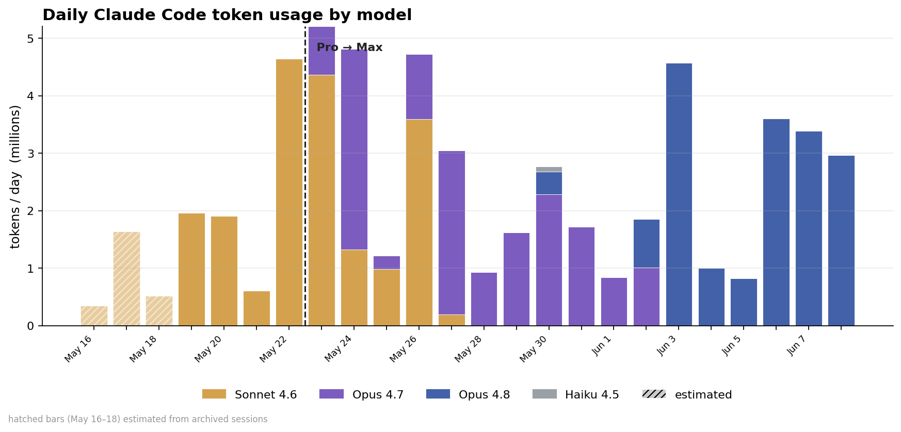
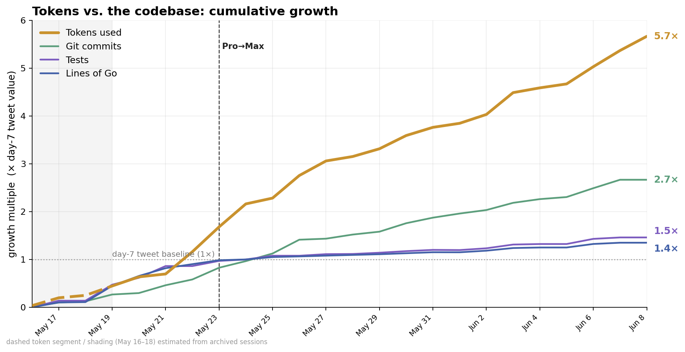
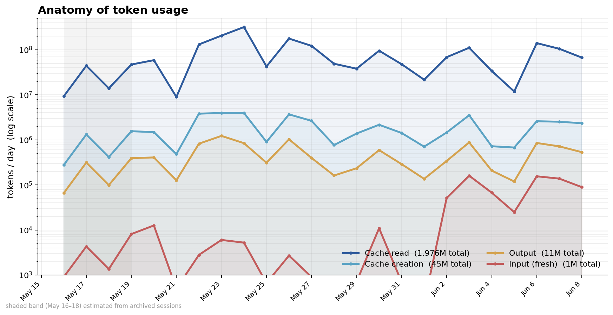
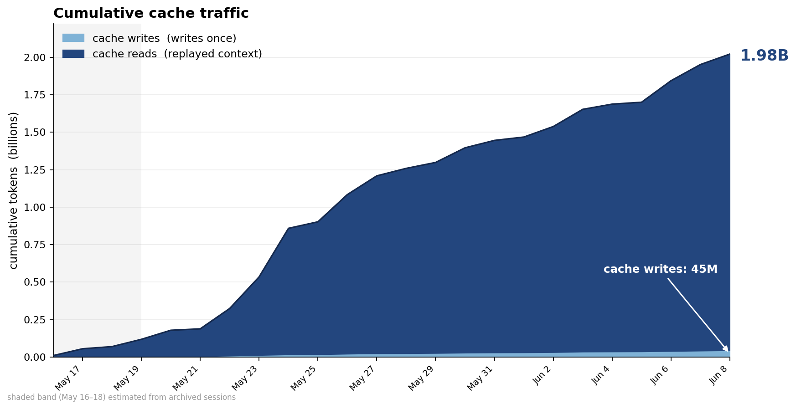

# Claude Code usage stats

A reproducible record of how much Claude Code work went into this project over
time — token usage, message counts, model mix — alongside the durable git output
(commits, tests, lines of Go), plus the charts derived from them.

This is **development-process metadata**, not part of the github-actions-gateway
product. It lives here so the numbers are preserved and recomputable.

## Why it's snapshotted

Token and message data comes from local Claude Code session transcripts
(`~/.claude/projects/*github-actions-gateway*/*.jsonl`). Those transcripts can be
**archived or deleted**, which would permanently lose the history. So the fragile
series are written to committed CSVs under [`data/`](data/) using a merge rule
that only ever revises a past day's value *upward*
([`compute_metrics.py`](compute_metrics.py) `merge_max`). Re-running after some
sessions are gone can never erase data already recorded.

Git-derived series are **recomputed from scratch** each run — git history is
durable, and counts like test totals or lines of Go can legitimately go down
(code gets deleted), so taking a max would be wrong for them.

### Backfilled (estimated) days

The project's first commits (2026-05-16 to -18) predate the earliest surviving
transcript (2026-05-19) — those sessions were archived before any were saved, so
their token usage is **gone from the logs**. Rather than drop those days, the
script **backfills** them: it derives a per-commit token rate from the Pro-era
window (the measured days before the Pro→Max upgrade) and multiplies by the
number of commits authored each archived day. Every backfilled row is flagged
`estimated=1` in the CSVs, surfaced separately in `summary.json`
(`totals.measured` vs `totals.estimated`), and drawn distinctly on the charts
(hatched bars, dashed lines, shaded band). The backfill is recomputed
deterministically each run; measured rows are never overwritten by estimates.

## Quick start

```bash
# 1. Snapshot the latest data (stdlib only — no venv needed):
python3 claude-usage/compute_metrics.py

# 2. Render the charts (needs matplotlib + numpy):
python3 -m venv .venv && .venv/bin/pip install -r claude-usage/requirements.txt
.venv/bin/python claude-usage/make_charts.py
```

`compute_metrics.py` reads the transcripts for *this* machine's copy of the
project. Override the lookup with `CLAUDE_PROJECTS_GLOB` if your transcripts live
elsewhere. `make_charts.py` reads **only** the committed CSVs, so the charts
reproduce identically on any machine, even with no transcripts present.

## Results

Snapshot at **2026-06-07** (project day 22; first commit 2026-05-16). "Day 7" is
the [original tweet](https://twitter.com)'s published figures.

| Metric | Day 7 | Day 22 | Source |
|---|--:|--:|---|
| Tokens (input + output + cache-creation) | ~10M | **56.2M** | transcripts + est. |
| └ measured only | — | 53.7M | transcripts |
| └ estimated backfill (May 16–18) | — | +2.5M | per-commit estimate |
| └ incl. cache reads | — | **2.02B** | transcripts + est. |
| Cache reuse ratio (reads ÷ writes) | — | **~44×** | transcripts |
| Git commits | 232 | **617** | git |
| Tests (`func Test*`) | 269 | **393** | git |
| Lines of Go (code) | 15.5k | **20.9k** | git |
| Lines of Go (comments) | 2.3k | **4.2k** | git |
| Markdown (non-blank) | 14.3k | **14.0k** | git |
| YAML (hand-written) | 1.5k | **2.3k** | git |
| Model mix | mostly Sonnet 4.6 | **Sonnet 43% / Opus 57%** | transcripts |

The headline tokens figure **includes the ~2.5M estimated backfill** for the
archived first three days; the measured-only floor is 53.7M. Live totals (with
the measured / estimated split) are always in
[`data/summary.json`](data/summary.json).

## Charts

Rendered to [`charts/`](charts/) at 1× and `@2x` (for upload). Each is
regenerable from the CSVs.

### A — Daily token usage by model

The Pro→Max upgrade (dashed line, 2026-05-23) is visible as the hand-off from
Sonnet 4.6 (gold) to Opus 4.7 (purple), then Opus 4.8 (blue).

### E — Tokens vs. the codebase: cumulative growth

Each series normalized to its **day-7 tweet value** (1×), so the lines cross
near the tweet and fan apart. Token spend grew ~5× while the code grew ~1.4×.

### F — Anatomy of token usage (log scale)

Daily input / output / cache-creation / cache-read, log Y. Cache reads sit an
order of magnitude above everything else, every day.

### I — Cumulative cache traffic

Cumulative cache reads (1.9B) vs writes (42M). Write once, replay ~45×.

## Data files

All under [`data/`](data/).

### `token_metrics.csv` — merge-preserved
| column | meaning |
|---|---|
| `date` | UTC date of the message timestamp |
| `input` / `output` | non-cached input and output tokens |
| `cache_creation` / `cache_read` | cache write and cache read tokens |
| `assistant_msgs` | assistant API responses (deduped on `message.id`+`requestId`) |
| `user_msgs` | user/tool-result records (deduped on record `uuid`) |
| `estimated` | `1` for backfilled (archived) days, `0` for measured |

### `model_daily.csv` — merge-preserved
Per-day, per-model `headline` (input+output+cache_creation), `output`,
`messages`, and an `estimated` flag. Backfilled archived days are attributed to
the Pro-era model (Sonnet 4.6). Drives chart A.

### `git_metrics.csv` — recomputed each run
Per-day (last commit of each day) cumulative `commits`, `tests`, and `go_code`
(non-blank minus line-comment Go lines, excluding `vendor/`).

### `summary.json`
Totals split into `measured` / `estimated` / `combined` (summed from the
persisted rows, so archival-safe), an `estimation` block documenting the
per-commit method, per-model split, an accurate HEAD working-tree snapshot, and
full provenance.

## Methodology & caveats

- **Dedup.** Resumed/compacted sessions replay earlier records verbatim. Token
  usage is deduped on `(message.id, requestId)`; without it cache-read totals
  roughly double. Message counts dedup on record `uuid`.
- **Archived early days are estimated, not measured.** The project's first
  commits (2026-05-16 to -18) predate the earliest surviving transcript
  (2026-05-19), so their token usage is gone from the logs. Those days are
  **backfilled** from the Pro-era per-commit rate and flagged `estimated=1`
  (see "Backfilled (estimated) days" above). The ~2.5M backfill is a modeled
  figure, not a measurement — the defensible measured-only floor is 53.7M. The
  git series is fully measured from 2026-05-16.
- **Chart E baseline.** Normalized against the *published* day-7 tweet values
  (10M / 232 / 269 / 15.5k), not a recomputed day-7 — so endpoints stay
  consistent with what was tweeted. The constants live in `make_charts.py`.
- **Date basis differs by source.** Token dates are UTC (from message
  timestamps); git dates are author-local (`--date=short`). Close enough at
  daily granularity, but they can disagree by a day at midnight boundaries.
- **`go_code` is approximate in the daily series** (non-blank minus line
  comments, so block comments count as code). `summary.json`'s HEAD snapshot
  uses an exact comment-aware split; the two agree to within ~0.1%.
- **Messages are fuzzy.** The original tweet's "20k messages" came from a
  counter that can't be reconstructed from these logs; treat `assistant_msgs` /
  `user_msgs` as the well-defined replacements, not as the same quantity.
