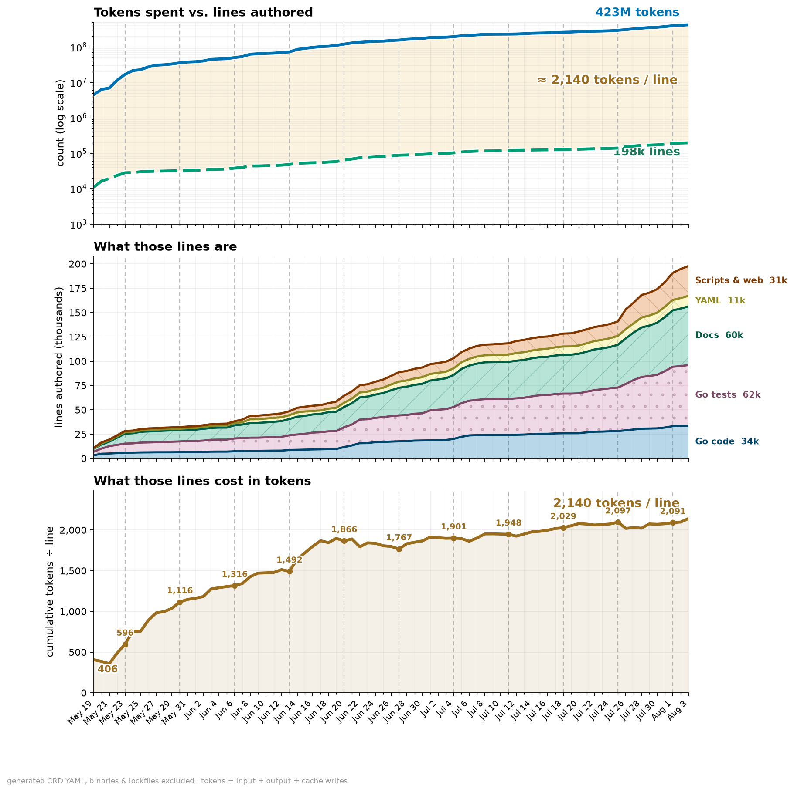
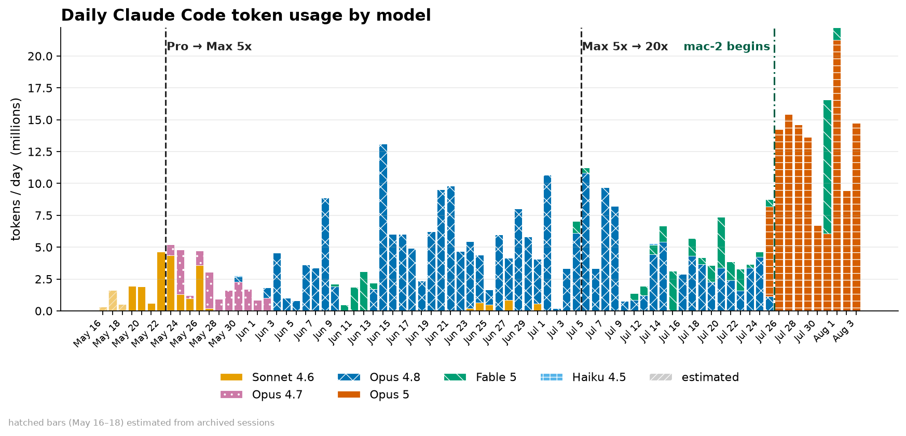
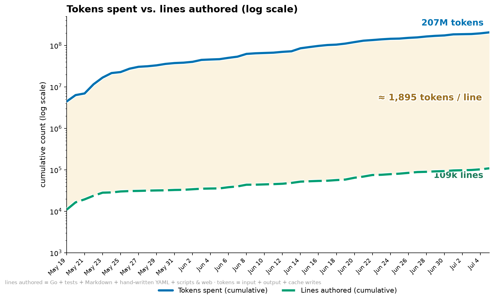
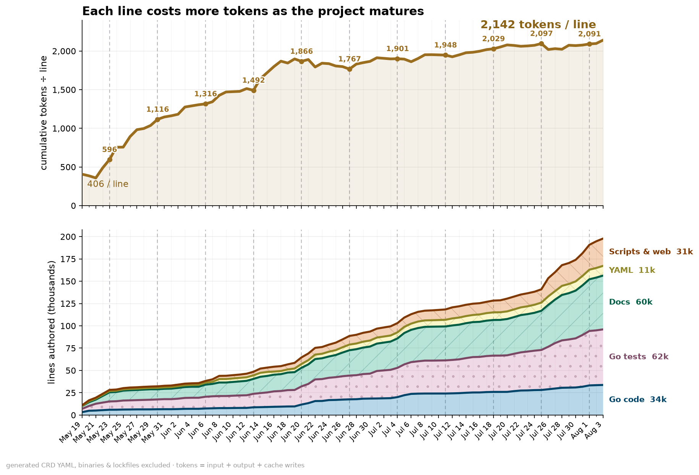
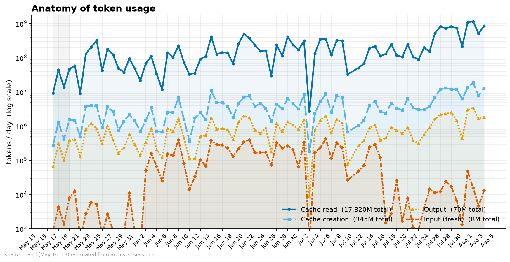
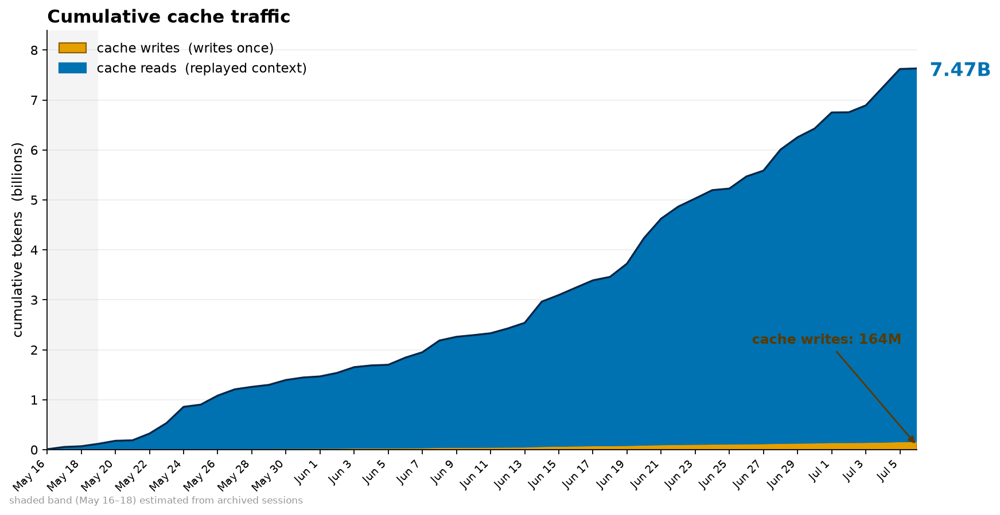
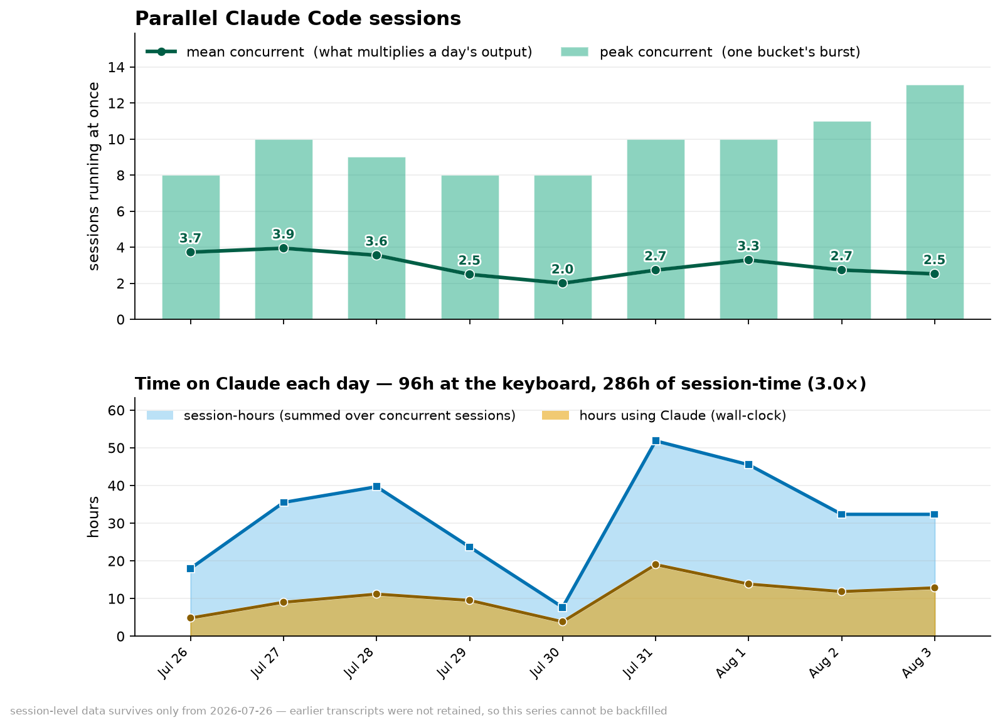

# Claude Code usage stats

A reproducible record of how much Claude Code work went into this project over time — token usage, message counts, model mix — alongside the durable git output (commits, tests, lines of Go), plus the charts derived from them.

This is **development-process metadata**, not part of the github-actions-gateway product.
It lives here so the numbers are preserved and recomputable.

## Why it's snapshotted

Token and message data comes from local Claude Code session transcripts (`~/.claude/projects/*github-actions-gateway*/*.jsonl`).
Those transcripts can be **archived or deleted**, which would permanently lose the history.
So the fragile series are written to committed CSVs under [`data/`](data/) using a merge rule that only ever revises a past day's value *upward* ([`compute_metrics.py`](compute_metrics.py) `merge_max`).
Re-running after some sessions are gone can never erase data already recorded.

Git-derived series are **recomputed from scratch** each run — git history is durable, and counts like test totals or lines of Go can legitimately go down (code gets deleted), so taking a max would be wrong for them.

### Multiple machines

Transcripts are local, so a machine only ever sees its own sessions.
Every token/message row therefore carries the `host` that measured it, and a day's total is the **sum across machines**.
The upward-only merge applies *within* a machine — it guards the archived-session case above — and never across them: a max across machines would silently keep only the busier one's share of a day worked on both.

Each machine names itself once, in a local-only file.
Hostnames aren't used: they're neither stable over a machine's life nor distinct between two similar laptops, and ids land in the committed CSVs.

```bash
mkdir -p ~/.config/claude-usage && echo mac-2 > ~/.config/claude-usage/host
```

`$CLAUDE_METRICS_HOST` overrides the file.
There is no fallback — an unconfigured machine aborts rather than invent an id.
For the same reason ids are **write-once**: renaming a machine makes it re-measure its whole history under the new id, on top of the rows still filed under the old one, and the two copies are summed.
The machine that produced every row predating the `host` column is `mac-1`.

**Replacing a machine?
Give the replacement a new id — never inherit the dead one's.** It is tempting, since the old machine is gone and the name is free, but the merge takes a per-column max *within* an id.
A replacement filing under `mac-1` would collide with the retired machine's rows on any day both worked, and the max would keep whichever share was larger and silently drop the other.
Under a fresh id the two land on separate rows and are summed.
Retired ids are never removed: a day's total sums every machine that ever reported it, not just the live ones.

### Backfilled (estimated) days

The project's first commits (2026-05-16 to -18) predate the earliest surviving transcript (2026-05-19) — those sessions were archived before any were saved, so their token usage is **gone from the logs**.
Rather than drop those days, the script **backfills** them: it derives a per-commit token rate from the Pro-era window (the measured days before the Pro→Max upgrade) and multiplies by the number of commits authored each archived day.
Every backfilled row is flagged `estimated=1` in the CSVs, surfaced separately in `summary.json` (`totals.measured` vs `totals.estimated`), and drawn distinctly on the charts (hatched bars, dashed lines, shaded band).
The backfill is recomputed deterministically each run; measured rows are never overwritten by estimates.

## Quick start

```bash
# 1. Once per machine — name it (see "Multiple machines" above):
mkdir -p ~/.config/claude-usage && echo mac-2 > ~/.config/claude-usage/host

# 2. Snapshot the latest data (stdlib only — no venv needed):
python3 claude-usage/compute_metrics.py

# 3. Render the charts (needs matplotlib + numpy):
python3 -m venv .venv && .venv/bin/pip install -r claude-usage/requirements.txt
.venv/bin/python claude-usage/make_charts.py
```

`compute_metrics.py` reads the transcripts for *this* machine's copy of the project.
Override the lookup with `CLAUDE_PROJECTS_GLOB` if your transcripts live elsewhere. `make_charts.py` reads **only** the committed CSVs, so the charts reproduce identically on any machine, even with no transcripts present.

The merge semantics are covered by [`test_compute_metrics.py`](test_compute_metrics.py):

```bash
python3 -m unittest discover -s claude-usage
```

That suite is a gate, not a convention: `make claude-usage-test` runs it as part of `make check`, and the `claude-usage-test` job in `.github/workflows/unit-test.yml` runs the same target on every pull request touching this directory.
It is stdlib-only, so it needs no venv — the `requirements.txt` install in Quick start above is for the charts alone.
The same target byte-compiles every `.py` here, which is the only check [`make_charts.py`](make_charts.py) gets: it has no tests and importing it needs matplotlib, so compiling is what catches a syntax error in it.

## Results

Latest snapshot **2026-08-15** (project day 92; first commit 2026-05-16).
"Day 7" is the [original day-7 Bluesky post][post1]'s published figures; "Day 22" is the [day-22 follow-up][post2]; "Day 92" is the current snapshot the charts here back.
The snapshots are announced as a quote-post chain (each post quotes the previous one): [day 7][post1] → [day 22][post2] → [day 35][post3] → [day 48][post4] → [day 70][post5].

> **Frozen snapshot.** The committed CSVs, `summary.json`, and charts are the 2026-08-15 snapshot.
> Re-running `compute_metrics.py` advances the token/message series as new sessions accrue (the merge rule only ever revises upward); leave it un-run to keep these figures, or re-run and refresh the charts to roll forward to a new dated snapshot.

| Metric | Day 7 | Day 22 | Day 92 | Source |
|---|--:|--:|--:|---|
| Tokens (input + output + cache-creation) | ~10M | 56.2M | **593.3M** | transcripts + est. |
| └ measured only | — | 53.7M | 590.8M | transcripts |
| └ estimated backfill (May 16–18) | — | +2.5M | +2.5M | per-commit estimate |
| └ incl. cache reads | — | 2.02B | **27.7B** | transcripts + est. |
| Cache reuse ratio (reads ÷ writes) | — | ~44× | **~55×** | transcripts |
| Git commits | 232 | 617 | **1,975** | git |
| Tests (`func Test*`) | 269 | 393 | **2,218** | git |
| Lines of Go (code) | 15.5k | 20.9k | **117.8k** | git |
| Lines of Go (comments) | 2.3k | 4.2k | **41.6k** | git |
| Markdown (non-blank) | 14.3k | 14.0k | **52.0k** | git |
| YAML (hand-written) | 1.5k | 2.3k | **12.5k** | git |
| Scripts & web (shell/Python/Make/Docker/CSS/JS) | — | — | **46.7k** | git |
| Model mix | mostly Sonnet 4.6 | Sonnet 43% / Opus 57% | **Opus 5 48% / Opus 4.8 37% / Fable 7% / Sonnet 4% / Opus 4.7 3%** | transcripts |
| Mean concurrent sessions | — | — | **3.0** (peak 16) | transcripts, since Jul 26 |
| Hours using Claude (wall-clock) | — | — | **211.0h** → 640.8h session-time | transcripts, since Jul 26 |

The headline tokens figure **includes the ~2.5M estimated backfill** for the archived first three days; the measured-only floor is 590.8M.
Live totals (with the measured / estimated split) are always in [`data/summary.json`](data/summary.json).

Markdown is the only count here still below where it stood two weeks ago (57.9k on 08-01), and nothing was deleted: the daily series runs 66.6k non-blank lines on 08-08, 49.0k the next day, 51.8k by 08-15.
[#1357](https://github.com/actions-gateway/github-actions-gateway/pull/1357) reflowed every tracked doc to one sentence per line on 2026-08-09, which unwraps hard-wrapped paragraphs: 67.6k non-blank lines before that commit, 49.0k after, same words.
Every line-count series here is a snapshot of the tree rather than a running total of lines ever written, so a reformat moves it.
The date carries a grey dotted marker on the three lines-and-ratio charts, and `provenance.docs_reflow_date` in `summary.json`, so the step is never mistaken for lost docs.

The Max 20x weekly token allowance also hit **99% for the first time**, in the seven-day window that ended when it reset on the morning of Monday 2026-08-10.
That ceiling is not visible in anything here, and it is not this project's headline figure hitting a wall: the allowance meters Anthropic's own weighted accounting across every project on the account, and this project's 96.4M for that window was in fact *below* the preceding week's 98.6M.

This snapshot spans a machine handover. `mac-1` measured everything through 2026-07-26 and has since been **retired**; `mac-2` replaced it, taking over mid-morning that day and measuring through 2026-08-15.
They overlap on 2026-07-26 alone, and the overlap is clean rather than double-counted: mac-1 recorded that morning, and every mac-2 record for the day starts at 10:26 local — the minute the replacement cloned the repo — so the day's total is their sum with no session counted on both.

Because mac-1 is gone, its rows are final and 2026-07-27 onward is mac-2 only and **complete**, not a day awaiting a second reporter.
Its transcripts went with the machine, so the committed CSVs are now the sole surviving record of the mac-1 era — the exact loss the snapshotting exists to prevent.
One gap can no longer be closed: mac-1's last row came from a snapshot taken partway through 2026-07-26, so anything it did later that day went unrecorded.

## Charts

Rendered to [`charts/`](charts/) at 1× and `@2x` (for upload).
Each is regenerable from the CSVs.

### Overview — all three tokens/lines views together
 The three tokens-vs-lines views combined into one shared-timeline figure: **(1)** magnitude — tokens vs lines authored on a log axis (gap = cost/line); **(2)** breakdown — what those lines are (the composition); **(3)** cost — cumulative tokens ÷ line, with the value at each weekly guide.
Event lines run through all three panels (labelled along the bottom of panel 1).
The standalone versions follow below.

### Daily token usage by model
 The Pro→Max 5x upgrade (first dashed line, 2026-05-23) is visible as the hand-off from Sonnet 4.6 (orange) to Opus 4.7 (purple), then Opus 4.8 (blue), with Fable 5 (green) appearing from June 9 and Opus 5 (vermillion) from July 25; the second dashed line (2026-07-05) marks the Max 5x→20x upgrade.
Opus 5 takes over almost completely from the green dash-dot line (2026-07-26), where `mac-2` took over, on days around three times the height of the Opus 4.8 era (median 14.9M across the `mac-2` days against 4.6M across the days Opus 4.8 led).
That jump is the model and the plan, **not** more machines running at once — `mac-2` replaced `mac-1` rather than joining it.
Charts use the Okabe–Ito colourblind-safe palette, and each model also carries its own hatch pattern.

Three kinds of event line, styled apart because they mean different things: a **black dashed** line is a plan upgrade (a higher ceiling on what one machine can spend), a **green dash-dot** line is a machine's rows beginning (a change in which machine is measuring), and a **grey dotted** line is the sentence-per-line reflow (a change in what a line *is*).
The reflow line appears only on the three lines-and-ratio charts, because it moved the denominator and nothing about what was spent; marking it on a token chart would invite the reading that the reformat cost or saved something.
Machine lines are derived from the first row each machine reports, so a third machine marks itself with no code change.
They read "begins" rather than "joins" because the data can't tell a replacement from an addition — an old machine going quiet is not evidence it was retired.
A label that would overlap one already placed drops a row instead, measured on the rendered figure: the two July markers shared a height comfortably at day 80 and collided at day 89, because every added day squeezes the timeline under a fixed figure width.

### Tokens spent vs. lines authored (the magnitude)
 Log y so both ends are visible at once: ~593M cumulative tokens ride well above ~228k lines authored (a linear axis crushes the lines to an invisible sliver).
The gold-shaded gap between the two curves is the ~2,601 tokens/line — on a log axis a ratio is a vertical gap.
"Lines authored" is all hand-written output — Go (code + tests), Markdown, hand-written YAML, and scripts & web; generated CRD YAML, binaries, and lockfiles excluded.
The undistorted breakdown of those lines is in the next chart.

### Tokens per line authored (the trend & the breakdown)
 **Top:** cumulative tokens ÷ lines authored, by day (measured days only).
It climbs from ~406 tokens/line in week one to ~2,601 by month three — each line costs ~6× more once the easy scaffolding is done and the work shifts to logic, tests, review, and debugging. **Bottom:** the denominator itself, decomposed — Go code, Go tests, Markdown docs, hand-written YAML, scripts & web.
Its total height at any date *is* the divisor above, so "a line" is shown, not just named; tests and docs together dwarf non-test Go code.
The grey dotted line on 2026-08-09 is the sentence-per-line reflow, which is why the Docs band notches down under it and the ratio above steps up: the same words on 18.6k fewer lines cost the same tokens, so roughly 200 of the ratio's climb past 2,400 is the reformat rather than the work.

### Anatomy of token usage (log scale)
 Daily input / output / cache-creation / cache-read, log Y. Cache reads sit an order of magnitude above everything else, every day.

### Cumulative cache traffic
 Cumulative cache reads (27.1B) vs writes (493M).
Write once, replay ~55×.
Both plan upgrades and the `mac-1`→`mac-2` handover are marked; the curve visibly steepens at the last of them.

### Parallel sessions
 How much of the work runs concurrently. **Top:** mean concurrency (line) against the day's peak (bars).
The peak is the dramatic number — up to 16 — but it lasts a single bucket; the **mean of 3.0** is what actually multiplies a day's output. **Bottom:** time on Claude each day, wall-clock against session-hours.
The gap between the two bands *is* the mean concurrency: **211h at the keyboard produced 641h of session-time** over the window, a 3.0× multiplier.
67% of active time had two or more sessions running, on 4–54 sessions a day.

**This chart has its own timeline, and starts at 2026-07-26.** Concurrency needs session-level transcripts, and no CSV before this one preserved them, so the mac-1 era cannot be reconstructed — daily token totals can't say how many sessions overlapped.
Drawing it against the project timeline would show 71 empty days and read as idleness rather than missing data.
The series is never estimated, for the same reason: unlike token volume, concurrency has no per-commit rate to model it from.

## Data files

All under [`data/`](data/).

### `token_metrics.csv` — merge-preserved
| column | meaning |
|---|---|
| `date` | UTC date of the message timestamp |
| `host` | machine that measured the row (`-` for estimated); sum a date's rows for the day's total |
| `input` / `output` | non-cached input and output tokens |
| `cache_creation` / `cache_read` | cache write and cache read tokens |
| `assistant_msgs` | assistant API responses (deduped on `message.id`+`requestId`) |
| `user_msgs` | user/tool-result records (deduped on record `uuid`) |
| `estimated` | `1` for backfilled (archived) days, `0` for measured |

### `model_daily.csv` — merge-preserved
Per-day, per-model, per-`host` `headline` (input+output+cache_creation), `output`, `messages`, and an `estimated` flag.
Backfilled archived days are attributed to the Pro-era model (Sonnet 4.6).
Drives the token-usage-by-model chart, which sums each (day, model) across machines.

### `git_metrics.csv` — recomputed each run
Per-day (last commit of each day) cumulative `commits`, `tests` (count of `func Test*`), `go_code` (non-blank minus line-comment Go lines, code + tests), `go_test` (the test-file subset of `go_code`), `md` (non-blank Markdown), `yaml` (non-blank hand-written YAML — generated CRD/controller-gen YAML excluded), and `scripts` (non-blank shell, Python, CSS/JS/HTML, Makefile, Dockerfile).
All exclude `vendor/`.

### `session_metrics.csv` — merge-preserved
Per-day, per-`host` session concurrency, in 10-minute buckets: `sessions` (distinct sessions that did work that day), `peak_concurrent` (most sessions active in any one bucket), `active_buckets` (buckets with any session), `parallel_buckets` (buckets with two or more), and `session_buckets` (concurrent sessions summed over every bucket).
Every column is a count that can only rise as more transcripts become visible, so the upward-only merge is right for all of them.

Two headline figures are derived rather than stored, because a ratio isn't monotone and so can't be max-merged:

| figure | from |
|---|---|
| **Hours using Claude** (wall-clock) | `active_buckets` ÷ 6 |
| **Session-hours** (summed over concurrent sessions) | `session_buckets` ÷ 6 |
| **Mean concurrency** | `session_buckets` ÷ `active_buckets` |

`active_buckets` is time actually spent using Claude: a bucket only counts when a session did something in it, so a session left open overnight adds nothing.
It measures engaged time, not session lifetime.

There is no `estimated` column — this series is measured or absent.
Summing across machines works for the bucket counts and `sessions`, but `peak_concurrent` is combined with a **max, not a sum**: two machines' peaks need not fall in the same bucket, so adding them would invent a burst that never happened.

A resumed session replays earlier records verbatim, which would credit the resuming session with work it only re-read, so each record is attributed to the earliest-starting session holding it.
Replays are ~3% of records here and shift one day's peak by one.

### `summary.json`
Totals split into `measured` / `estimated` / `combined` (summed from the persisted rows, so archival-safe), an `estimation` block documenting the per-commit method, a `sessions` block (bucket width, span, session-days, mean and peak concurrency, hours using Claude, session-hours, parallel share), per-model and per-machine (`by_host`) splits, an accurate HEAD working-tree snapshot, and full provenance — including which machine took the snapshot, which machines are on record, and the dates that break a series (the two plan upgrades and the docs reflow).

## Methodology & caveats

- **Dedup.** Resumed/compacted sessions replay earlier records verbatim.
  Token usage is deduped on `(message.id, requestId)`; without it cache-read totals roughly double.
  Message counts dedup on record `uuid`.
- **A day is only as complete as the machines that have reported it.** Rows are per `(date, machine)` and summed, so a day worked on two machines is only whole once both have run the script and their rows are committed.
  Until then the day reads low rather than wrong — nothing is lost, and a later run from the missing machine fills it in.
  No machine is outstanding in this snapshot: `mac-1` is retired and `mac-2` measured through the snapshot date.
  A retired machine can never report again, so whatever it had not captured by its last run is gone rather than pending.
- **Archived early days are estimated, not measured.** The project's first commits (2026-05-16 to -18) predate the earliest surviving transcript (2026-05-19), so their token usage is gone from the logs.
  Those days are **backfilled** from the Pro-era per-commit rate and flagged `estimated=1` (see "Backfilled (estimated) days" above).
  The ~2.5M backfill is a modeled figure, not a measurement — the defensible measured-only floor is 590.8M.
  The git series is fully measured from 2026-05-16.
- **"Concurrent" is a bucket width, not a fact.** A session counts as active in a 10-minute bucket if it produced a record there, so two sessions are "concurrent" when both worked within the same 10 minutes — not necessarily in the same second.
  The width is a judgement: wide enough that a session waiting on a build still counts as in flight, narrow enough that work hours apart never collides.
  At 1-minute buckets the daily peaks come out 2–14 rather than 3–16, so the peak barely moves, while every figure with time in it does: the mean falls to 2.2, the parallel share to 53%, and wall-clock hours to 128 from 211, because the bucket *is* the unit of time.
- **Tokens-per-line is a proxy.** The denominator is all hand-authored output — Go (code + tests), Markdown, hand-written YAML, and scripts & web (shell, Python, Make/Docker, CSS/JS) — but tokens also go into review, debugging, and exploration that never lands as a line, so the ratio tracks overall effort-per-output, not the literal cost of one line.
  Generated YAML (CRDs/controller-gen, ~130k lines), binaries, lockfiles, and license boilerplate are excluded so non-authored content doesn't dilute it.
  Estimated (pre-transcript) days are excluded so it's measured-only.
  The denominator is also the current tree rather than everything ever written, so a pure reformat moves the ratio: the 2026-08-09 sentence-per-line reflow lifted it ~8% on no extra spend ([Q824](../docs/STATUS.md#Q824)).
- **The plan's weekly ceiling is not in this data.** The Max 20x allowance first ran to 99% in the window that reset on 2026-08-10, so from here on a short day can be a limit rather than a choice.
  Nothing in the transcripts records it: every `rateLimits` field they carry is null, and the allowance meters every project on the account while these CSVs cover one.
  It is a dated note in Results above, not a series.
- **Date basis differs by source.** Token dates are UTC (from message timestamps); git dates are author-local (`--date=short`).
  Close enough at daily granularity, but they can disagree by a day at midnight boundaries.
- **`go_code` is approximate in the daily series** (non-blank minus line comments, so block comments count as code). `summary.json`'s HEAD snapshot uses an exact comment-aware split; the two agree to within ~0.1%.
- **Messages are fuzzy.** The original post's "20k messages" came from a counter that can't be reconstructed from these logs; treat `assistant_msgs` / `user_msgs` as the well-defined replacements, not as the same quantity.

[post1]: https://bsky.app/profile/karlkfi.bsky.social/post/3mmpo56ds6c23
[post2]: https://bsky.app/profile/karlkfi.bsky.social/post/3mnqwj3nlhk2x
[post3]: https://bsky.app/profile/karlkfi.bsky.social/post/3moqxgrpouk23
[post4]: https://bsky.app/profile/karlkfi.bsky.social/post/3mprnre3zsc2v
[post5]: https://bsky.app/profile/karlkfi.bsky.social/post/3mrftwskoas2r
