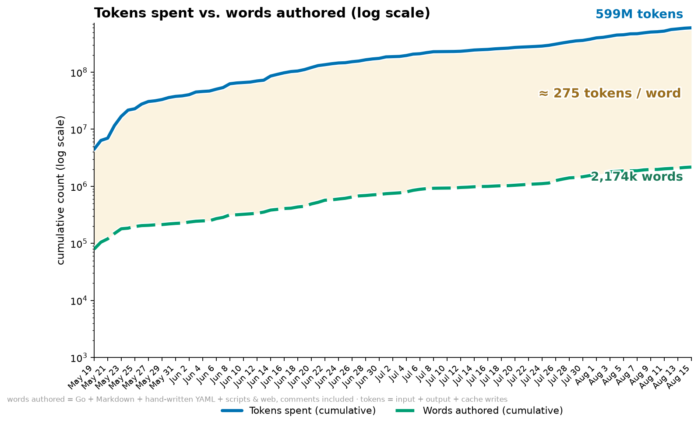
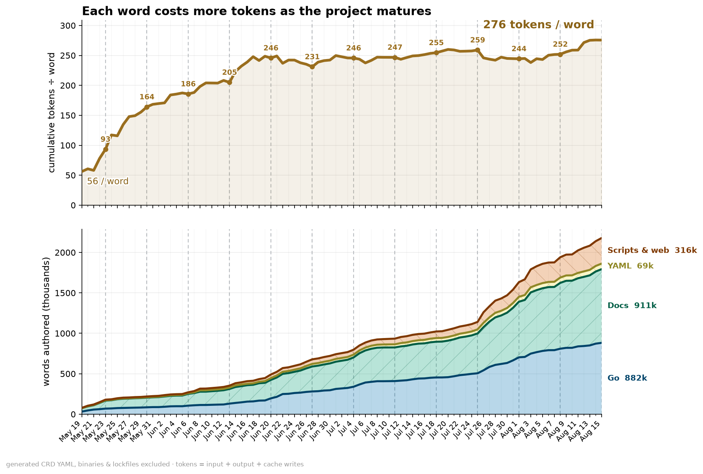
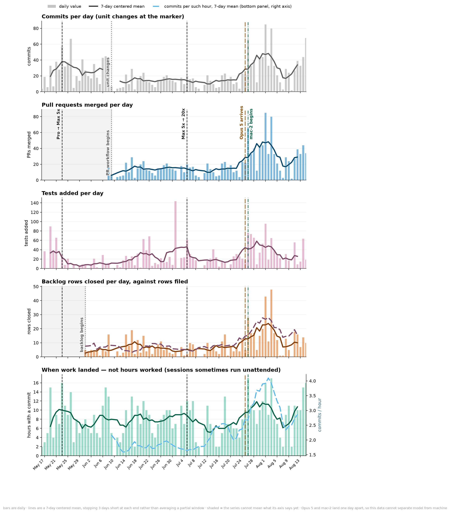
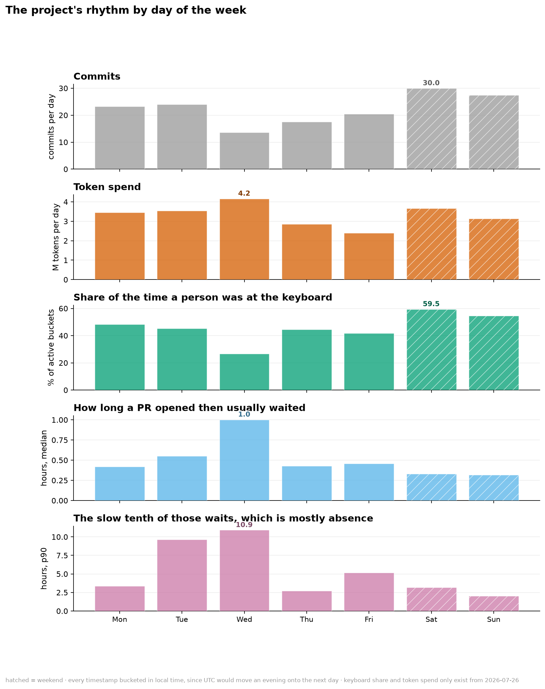
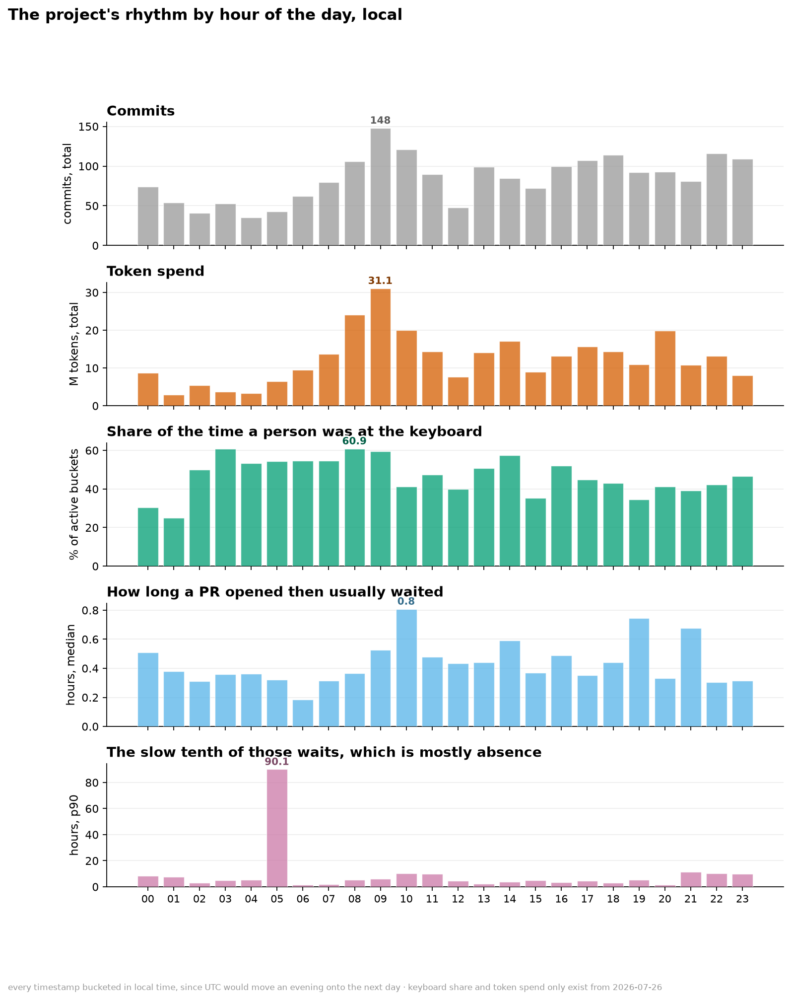
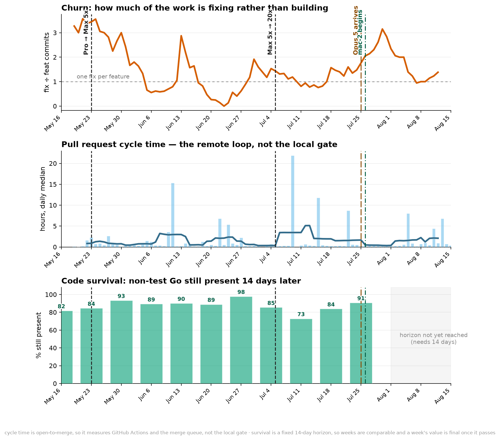
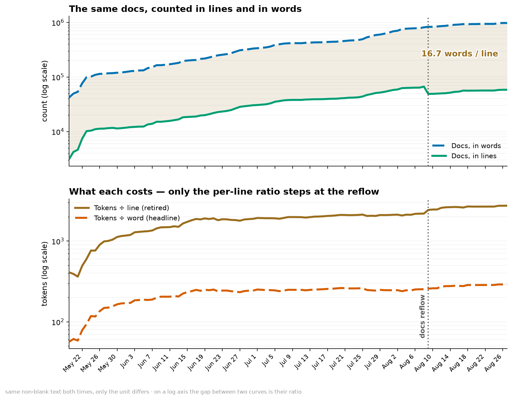

# Claude Code usage stats

A reproducible record of how much Claude Code work went into this project over time — token usage, message counts, model mix — alongside the durable git output (commits, tests, lines of Go), plus the charts derived from them.

This is **development-process metadata**, not part of the github-actions-gateway product.
It lives here so the numbers are preserved and recomputable.

## Why it's snapshotted

Token and message data comes from local Claude Code session transcripts (`~/.claude/projects/*github-actions-gateway*/*.jsonl`).
Those transcripts can be **archived or deleted**, which would permanently lose the history.
So the fragile series are written to committed CSVs under [`data/`](data/) using a merge rule that only ever revises a past day's value *upward* ([`compute_metrics.py`](compute_metrics.py) `merge_max`).
Re-running after some sessions are gone can never erase data already recorded.

Git-derived series are **recomputed from scratch** each run — git history is durable, and counts like test totals or lines of Go can legitimately go down (code gets deleted), so taking a max would be wrong for them.

### Multiple machines

Transcripts are local, so a machine only ever sees its own sessions.
Every token/message row therefore carries the `host` that measured it, and a day's total is the **sum across machines**.
The upward-only merge applies *within* a machine — it guards the archived-session case above — and never across them: a max across machines would silently keep only the busier one's share of a day worked on both.

Each machine names itself once, in a local-only file.
Hostnames aren't used: they're neither stable over a machine's life nor distinct between two similar laptops, and ids land in the committed CSVs.

```bash
mkdir -p ~/.config/claude-usage && echo mac-2 > ~/.config/claude-usage/host
```

`$CLAUDE_METRICS_HOST` overrides the file.
There is no fallback — an unconfigured machine aborts rather than invent an id.
For the same reason ids are **write-once**: renaming a machine makes it re-measure its whole history under the new id, on top of the rows still filed under the old one, and the two copies are summed.
The machine that produced every row predating the `host` column is `mac-1`.

**Replacing a machine?
Give the replacement a new id — never inherit the dead one's.** It is tempting, since the old machine is gone and the name is free, but the merge takes a per-column max *within* an id.
A replacement filing under `mac-1` would collide with the retired machine's rows on any day both worked, and the max would keep whichever share was larger and silently drop the other.
Under a fresh id the two land on separate rows and are summed.
Retired ids are never removed: a day's total sums every machine that ever reported it, not just the live ones.

### Backfilled (estimated) days

The project's first commits (2026-05-16 to -18) predate the earliest surviving transcript (2026-05-19) — those sessions were archived before any were saved, so their token usage is **gone from the logs**.
Rather than drop those days, the script **backfills** them: it derives a per-commit token rate from the Pro-era window (the measured days before the Pro→Max upgrade) and multiplies by the number of commits authored each archived day.
Every backfilled row is flagged `estimated=1` in the CSVs, surfaced separately in `summary.json` (`totals.measured` vs `totals.estimated`), and drawn distinctly on the charts (hatched bars, dashed lines, shaded band).
The backfill is recomputed deterministically each run; measured rows are never overwritten by estimates.

## Quick start

```bash
# 1. Once per machine — name it (see "Multiple machines" above):
mkdir -p ~/.config/claude-usage && echo mac-2 > ~/.config/claude-usage/host

# 2. Snapshot the latest data (stdlib only — no venv needed):
python3 claude-usage/compute_metrics.py

# 3. Render the charts (needs matplotlib + numpy):
python3 -m venv .venv && .venv/bin/pip install -r claude-usage/requirements.txt
.venv/bin/python claude-usage/make_charts.py
```

`compute_metrics.py` reads the transcripts for *this* machine's copy of the project.
Override the lookup with `CLAUDE_PROJECTS_GLOB` if your transcripts live elsewhere.
`make_charts.py` reads **only** the committed CSVs, so the charts reproduce identically on any machine, even with no transcripts present.

The merge semantics are covered by [`test_compute_metrics.py`](test_compute_metrics.py):

```bash
python3 -m unittest discover -s claude-usage
```

That suite is a gate, not a convention: `make claude-usage-test` runs it as part of `make check`, and the `claude-usage-test` job in `.github/workflows/unit-test.yml` runs the same target on every pull request touching this directory.
It is stdlib-only, so it needs no venv — the `requirements.txt` install in Quick start above is for the charts alone.
The same target byte-compiles every `.py` here, which is the only check [`make_charts.py`](make_charts.py) gets: it has no tests and importing it needs matplotlib, so compiling is what catches a syntax error in it.

## Results

Latest snapshot **2026-08-15** (project day 92; first commit 2026-05-16).
"Day 7" is the [original day-7 Bluesky post][post1]'s published figures; "Day 22" is the [day-22 follow-up][post2]; "Day 92" is the current snapshot the charts here back.
The snapshots are announced as a quote-post chain (each post quotes the previous one): [day 7][post1] → [day 22][post2] → [day 35][post3] → [day 48][post4] → [day 70][post5].

> **Frozen snapshot.** The committed CSVs, `summary.json`, and charts are the 2026-08-15 snapshot.
> Re-running `compute_metrics.py` advances the token/message series as new sessions accrue (the merge rule only ever revises upward); leave it un-run to keep these figures, or re-run and refresh the charts to roll forward to a new dated snapshot.

| Metric | Day 7 | Day 22 | Day 92 | Source |
|---|--:|--:|--:|---|
| Tokens (input + output + cache-creation) | ~10M | 56.2M | **600.3M** | transcripts + est. |
| └ measured only | — | 53.7M | 597.8M | transcripts |
| └ estimated backfill (May 16–18) | — | +2.5M | +2.5M | per-commit estimate |
| └ incl. cache reads | — | 2.02B | **28.4B** | transcripts + est. |
| Cache reuse ratio (reads ÷ writes) | — | ~44× | **~56×** | transcripts |
| Git commits | 232 | 617 | **2,019** | git |
| Tests (`func Test*`) | 269 | 393 | **2,218** | git |
| Lines of Go (code) | 15.5k | 20.9k | **117.8k** | git |
| Lines of Go (comments) | 2.3k | 4.2k | **41.6k** | git |
| Markdown (non-blank) | 14.3k | 14.0k | **54.0k** | git |
| YAML (hand-written) | 1.5k | 2.3k | **12.5k** | git |
| Scripts & web (shell/Python/Make/Docker/CSS/JS) | — | — | **47.8k** | git |
| **Words authored** (Go + docs + hand-written YAML + scripts) | — | — | **2.18M** | git |
| **Tokens per word** | — | — | **276** | both |
| Model mix | mostly Sonnet 4.6 | Sonnet 43% / Opus 57% | **Opus 5 49% / Opus 4.8 37% / Fable 7% / Sonnet 4% / Opus 4.7 3%** | transcripts |
| Mean concurrent sessions | — | — | **3.0** (peak 16) | transcripts, since Jul 26 |
| Hours using Claude (wall-clock) | — | — | **216.8h** → 655.3h session-time | transcripts, since Jul 26 |
| └ of that, at the keyboard | — | — | **101.5h** (47%) | transcripts, since Jul 26 |

The headline tokens figure **includes the ~2.5M estimated backfill** for the archived first three days; the measured-only floor is 597.8M.
Live totals (with the measured / estimated split) are always in [`data/summary.json`](data/summary.json).

Markdown is the only count here still below where it stood two weeks ago (57.9k on 08-01), and nothing was deleted: the daily series runs 66.6k non-blank lines on 08-08, 49.0k the next day, 53.7k by 08-15.
[#1357](https://github.com/actions-gateway/github-actions-gateway/pull/1357) reflowed every tracked doc to one sentence per line on 2026-08-09, which unwraps hard-wrapped paragraphs: 67.6k non-blank lines before that commit, 49.0k after, same words.
Every line-count series here is a snapshot of the tree rather than a running total of lines ever written, so a reformat moves it.
The date carries a grey dotted marker on the three lines-and-ratio charts, and `provenance.docs_reflow_date` in `summary.json`, so the step is never mistaken for lost docs.

The Max 20x weekly token allowance also hit **99% for the first time**, in the seven-day window that ended when it reset on the morning of Monday 2026-08-10.
That ceiling is not visible in anything here, and it is not this project's headline figure hitting a wall: the allowance meters Anthropic's own weighted accounting across every project on the account, and this project's 96.4M for that window was in fact *below* the preceding week's 98.6M.

This snapshot spans a machine handover.
`mac-1` measured everything through 2026-07-26 and has since been **retired**; `mac-2` replaced it, taking over mid-morning that day and measuring through 2026-08-15.
They overlap on 2026-07-26 alone, and the overlap is clean rather than double-counted: mac-1 recorded that morning, and every mac-2 record for the day starts at 10:26 local — the minute the replacement cloned the repo — so the day's total is their sum with no session counted on both.

Because mac-1 is gone, its rows are final and 2026-07-27 onward is mac-2 only and **complete**, not a day awaiting a second reporter.
Its transcripts went with the machine, so the committed CSVs are now the sole surviving record of the mac-1 era — the exact loss the snapshotting exists to prevent.
One gap can no longer be closed: mac-1's last row came from a snapshot taken partway through 2026-07-26, so anything it did later that day went unrecorded.

## Charts

Rendered to [`charts/`](charts/) at 1× and `@2x` (for upload).
Each is regenerable from the CSVs.

### Overview: all three tokens/lines views together
 The three tokens-vs-lines views combined into one shared-timeline figure: **(1)** magnitude, tokens vs words authored on a log axis (gap = cost/word); **(2)** breakdown, what those words are; **(3)** cost, cumulative tokens ÷ word with the value at each weekly guide.
Event lines run through all three panels (labelled along the bottom of panel 1).
Where one crosses a value label it passes *behind* the digits and breaks around them, rather than striking through: the labels are drawn above the lines and cut them with their own white halo, so a gap in an event line at a number is the number winning, not a change of line style.
The standalone versions follow below.

### Daily token usage by model
 The Pro→Max 5x upgrade (first dashed line, 2026-05-23) is visible as the hand-off from Sonnet 4.6 (orange) to Opus 4.7 (purple), then Opus 4.8 (blue), with Fable 5 (green) appearing from June 9 and Opus 5 (vermillion) from July 25; the second dashed line (2026-07-05) marks the Max 5x→20x upgrade.
Opus 5 takes over almost completely from the green dash-dot line (2026-07-26), where `mac-2` took over, on days around three times the height of the Opus 4.8 era (median 14.9M across the `mac-2` days against 4.6M across the days Opus 4.8 led).
That jump is **not** more machines running at once: `mac-2` replaced `mac-1` rather than joining it.
The plan is a different question these series cannot answer: the Max 5x → 20x upgrade three weeks earlier moved none of them, but what both upgrades relieved was the 5-hour rolling limit, which nothing here measures.
What it cannot be pinned on is either the model or the machine alone, since Opus 5 arrived the day before `mac-2` did.
See the [velocity chart](#work-shipped-on-proxies-a-reformat-cant-move).
Charts use the Okabe–Ito colourblind-safe palette, and each model also carries its own hatch pattern.

Three kinds of event line, styled apart because they mean different things: a **black dashed** line is a plan upgrade (a higher ceiling on what one machine can spend), a **green dash-dot** line is a machine's rows beginning (a change in which machine is measuring), and a **grey dotted** line is the sentence-per-line reflow (a change in what a line *is*).
The reflow line appears only on the three lines-and-ratio charts, because it moved the denominator and nothing about what was spent; marking it on a token chart would invite the reading that the reformat cost or saved something.
Machine lines are derived from the first row each machine reports, so a third machine marks itself with no code change.
They read "begins" rather than "joins" because the data can't tell a replacement from an addition: an old machine going quiet is not evidence it was retired.
A label that would overlap one already placed drops a row instead, measured on the rendered figure: the two July markers shared a height comfortably at day 80 and collided at day 89, because every added day squeezes the timeline under a fixed figure width.

### Tokens spent vs. words authored (the magnitude)
 Log y so both ends are visible at once. ~600M cumulative tokens ride well above ~2.18M words authored; a linear axis crushes the smaller series to a sliver.
The gold-shaded gap between the two curves is the ~276 tokens/word; on a log axis a ratio is a vertical gap.
"Words authored" is all hand-written output: Go (code + tests), Markdown, hand-written YAML, and scripts & web, comments included; generated CRD YAML, binaries, and lockfiles excluded.
The undistorted breakdown of those lines is in the next chart.

### Tokens per word authored (the trend & the breakdown)
 **Top:** cumulative tokens ÷ words authored, by day (measured days only).
It climbs from ~56 tokens/word in week one to ~276 by month three, each word costing ~5× more once the easy scaffolding is done and the work shifts to logic, tests, review, and debugging.
Unlike its per-line predecessor it then **plateaus** from mid-June, hovering in the 230–275 band rather than climbing all cycle.
**Bottom:** the denominator itself, decomposed into Go, Markdown docs, hand-written YAML, and scripts & web.
Its total height at any date *is* the divisor above, so "a word" is shown, not just named; docs alone very nearly match all of Go.
There is no reflow marker on this chart, and that is the point of the switch: the 2026-08-09 reformat moved lines and not words, so neither the band nor the ratio above it notices.
The marker now appears only where a lines series is drawn, following the same rule the other event markers do.

### Work shipped, on proxies a reformat can't move
 Tokens are an input and lines carry the reflow, so neither is a velocity series.
These four are immune to both: **PRs merged**, **tests added**, **backlog rows closed**, and the spread of the day work landed across.

Read the top three together and the plan upgrade does not show up: tests/day went 20.3 to 19.4 across 2026-07-05, Go lines/day 1,058 to 963.
That is a null result from a proxy that cannot observe the mechanism, not a finding that the upgrade did nothing.
Both upgrades were made because the **5-hour rolling limit** was binding, and no series here can see a 5-hour window, an account-wide meter, or a session that stalled waiting for one.
What moves is the pair of lines three weeks later, and **that is exactly what this chart cannot resolve**.
Opus 5 arrives 2026-07-25 and `mac-2` begins 2026-07-26, so the model and the machine are one day apart and no series here can say which did it.
Drawing both markers is the point; the single Opus-5-on-`mac-1` day is one data point and settles nothing.

The machine's side is measured elsewhere, though: a cold `make check` went from ~21 min on the retired Intel machine to **102 s** on its replacement, and [#1110](https://github.com/actions-gateway/github-actions-gateway/pull/1110) later sized the parallel-dispatch worker cap from RAM and cores rather than a constant.
A 12× faster gate is not something a model does.

Bars are daily and every line is a **7-day centered mean**, which is what makes the inflection legible: all three top series sit flat through June and most of July, then climb from the 07-25/26 pair.
Centered rather than trailing, because a trailing mean lags by half its window and would slide every inflection three days later than the day it happened, straight into the confound.
Each line stops three days short at either end rather than averaging a partial window.

Two shaded regions mark where a series cannot yet mean what its axis says: before the repo adopted PR squash-merges, and before `docs/STATUS.md` existed.
No trend line is drawn inside them.
**Commits are drawn despite being contaminated**, with a marker where the unit changes: before it a commit is one commit, after it a whole squashed PR.
Its trend line is broken either side of that marker rather than run through it, because the mean of a window spanning the switch averages two different units.
The panel is unshaded, unlike the two below it, since commits are real on both sides and only counted differently.

**The backlog panel draws filed against closed.** Closures alone cannot tell progress from treading water: the busiest stretch closed 15 rows a day while filing 20, so the backlog grew by 106 rows over that window, faster than in any earlier era.
That is not automatically bad, since filing more can mean finding more real work, but the direction is only visible with both lines.

**Panel 4 is not hours worked.** Sessions sometimes run unattended and keep committing with nobody watching, and merges get cleared in bulk, so it shows when work *landed* rather than when anyone was present.
Its bars and their trend cover the whole project; the commits-per-hour line starts later, because its numerator is `commits` and that series changes units at the PR-workflow switch.

### The project's rhythm, by weekday and by hour
  Aggregates rather than time series: every day of the project lands in one bucket.
Built to look rather than to confirm, since which of these would differ by the clock was not known in advance.

**Wednesday is the outlier, on every panel at once.** Fewest commits (13.6 a day against Saturday's 30.0), the *most* tokens spent (4.2M a day, the highest of any day), the least time at the keyboard (26% against Saturday's 60%), and the longest PR waits by both median and p90.
Most spend, least output, least presence.
That is one fact seen five ways rather than five findings: it is the day the maintainer is least available, so sessions run on without anyone to steer or merge them.
Wednesday's *median* commit count is lowest too, so it is a consistent property of the twelve Wednesdays rather than one bad day dragging a mean.

**Weekends run 1.4× weekdays**, 28.0 commits a day against 19.9.
A permutation test over 20,000 shuffles puts that gap at p = 0.020, so it is not the day-to-day variance.
Sunday has the highest p25 of any day, meaning Sundays are reliably productive; Saturday is right-skewed, a few very large days.
This is the time-investment variable made visible: weekdays compete with paid work and weekends do not.

By hour, the work runs 07:00 to 23:00 local with a sharp 09:00 peak in both commits and spend, a midday dip, and a long evening plateau.
Presence is lowest just after midnight, which is where the unattended share is largest.

Everything is bucketed in **local** time, and the offset comes from the repo's own git timestamps rather than a setting.
UTC would have moved most of an evening's work onto the following day and flattened the very patterns these charts exist to show.

### How the work went, not just how much
 The volume proxies above cannot tell 85 PRs of progress from 85 PRs of churn.
These three can say something about it, each with a different blind spot, which is why they are drawn side by side rather than combined into a score.

**Churn** is `fix` against `feat` commits over a rolling week, since a daily ratio has days with no denominator.
It ran 1.51 in the Pro era, 1.00 under Max 20x, and **1.82** in the `mac-2` era: the busiest stretch spends the largest share of its commits fixing.
Read it with both its blind spots in view, because they do not cancel: a `fix` may repair something written months earlier, and this repo added gates over the same window, so better detection raises the ratio without more defects existing.

**Pull request open to merge** is **availability-bound, and not a speed measure**, which is worth stating twice because it was proposed as one.
Two things break that reading.
The local gate runs before a PR is opened, so this never contained the 12× hardware speed-up.
And merging here needs a human to enqueue, so a PR opened while nobody is at the machine waits exactly as long as that lasts.

The distribution says how much that dominates.
Across eras the p99 runs **33.7h, 90.0h, then 23.4h**: multi-day waits, which are days away rather than anything slow.
So the panel draws two percentiles instead of a median.
**p25** is the part availability cannot stretch and stands in for the loop itself; **p90** is mostly a record of being elsewhere.

The median was the wrong statistic and it misled: it rose 0.35h to 0.53h across the handover while p10 held flat at 0.09h and both p90 and p99 **fell**.
The distribution tightened rather than slowed, and the median moved because the share merged inside 30 minutes fell from 58% to 48%, not because the slow end got slower.

**Code survival** asks whether a week's output lasted: what share of the non-test Go written in a week was still present 14 days later.
It runs 73–98% with no era trend, and the `mac-2` week sits at 91%, among the highest.
So by this measure the doubled output is not less durable, which cuts against the churn reading and is why neither is presented alone.
The horizon is fixed rather than measured to `HEAD` so every week is judged over the same window; the last two weeks are blank because theirs has not passed.

### Why the headline is words, not lines
 This is the chart that retires the per-line ratio.
A rewrap moves every line count that spans a paragraph and leaves the words alone, so a per-line cost figure carries any reformat the project ever does.
On the reflow day Markdown went **−17,574 lines and +15,098 words**.
A second, much smaller reformat then landed on 2026-08-15 ([#1555](https://github.com/actions-gateway/github-actions-gateway/pull/1555), an mdreflow upgrade): **+1,251 lines and +60 words**.
The headline ratio did not notice it, which is the case for the switch made concretely rather than argued.

**Only the first reformat carries a marker, and the test is magnitude rather than category.** The 08-09 reflow moved the line series 26.4% in a day, 0.133 of a decade on a log axis, which reads as deleted docs unless something says otherwise.
The 08-15 one moved it 3.4%, 0.015 of a decade, and roughly a third of even that was the day's ordinary writing rather than the reformat.
A line there would mark something a reader cannot see and would then have to explain away.
In words, the unit the headline now uses, the second reformat is 1.4% against the *first* reflow day's 1.9%: neither is visible, which is the whole point of the denominator.
The line series reads as a catastrophe, the word series as an ordinary productive day.

Log y, absolute counts, the same choice the tokens-vs-lines chart makes: words outnumber lines about 17 to 1, so a linear axis leaves the smaller series a sliver.
**Top:** the docs corpus in each unit, with the shaded gap between them being the words-per-line ratio, since on a log axis a ratio is a vertical gap.
**Bottom:** cumulative tokens ÷ line against tokens ÷ word.
Only the per-line ratio steps on 2026-08-09, which is why the headline is now the other one.
Words are also the unit closest to a token, which makes the ratio a comparison between two counts of the same kind rather than a count against a layout choice.
The gap in the top panel is where the mechanism shows: sentence-per-line put the same words on fewer lines, so words per line went from 12.2 to 16.9 overnight and the band visibly widens.

The underlying climb is real in both units, which is the more interesting finding: cost per word still rose ~4.9× over the project against ~6.4× per line, so the trend was never an artifact; only the 2026-08-09 jump in the per-line version was.

### Anatomy of token usage (log scale)
 Daily input / output / cache-creation / cache-read, log Y. Cache reads sit an order of magnitude above everything else, every day.

### Cumulative cache traffic
 Cumulative cache reads (27.8B) vs writes (499M).
Write once, replay ~56×.
Both plan upgrades and the `mac-1`→`mac-2` handover are marked; the curve visibly steepens at the last of them.

### Parallel sessions
 How much of the work runs concurrently.
**Top:** mean concurrency (line) against the day's peak (bars).
The peak is the dramatic number, up to 16, but it lasts a single bucket; the **mean of 3.0** is what actually multiplies a day's output.
**Bottom:** time on Claude each day, wall-clock against session-hours.
The gap between the two bands *is* the mean concurrency: **217h elapsed produced 655h of session-time** over the window, a 3.0× multiplier.
67% of active time had two or more sessions running, on 4–54 sessions a day.

The innermost band **is** time someone spent at the keyboard, and it is 47% of the rest: **101.5h against 216.8h**.
A 10-minute bucket counts as attended when a person actually typed in it, which is the only unambiguous presence signal the transcripts carry.
Everything else here, every assistant record and every tool result, is produced whether or not anyone is watching.

Identifying a typed prompt takes more than the record's own marker.
`origin.kind == "human"` also arrives on four things nobody typed: a hook's denial text, a `<bash-input>` line and its output, a slash command's expansion, and an injected `<system-reminder>`.
The predicate strips those; without it the count roughly doubles.

**This band cannot reach back before 2026-07-26**, because the transcripts only began carrying that marker then and `mac-1`'s went with the machine.
It is the measure that would answer whether the new machine raised output per attended hour, and the window where it exists starts on the day the machine changed, so it cannot answer that and never will.
What it can do is serve as a denominator from here on.
Sessions sometimes run unattended, so a bucket counts whenever a session did something and the human may be elsewhere; these are hours the system was working, not hours at the keyboard.

How much attention a day needed varies with the work, which is why no fixed fraction can be read off these bands.
Coding needs the least and parallelizes best, so it fills the widest bands with the fewest prompts.
Work on skills, prose, process, and backlog grooming needs more attention per session and runs narrower.
The mix also runs both ways at once: a parallel dispatcher can be draining the backlog while attention goes to a hand-prompted session beside it.
And the ceiling on all of it is external, since days given to other projects or to paid work are simply days this machine sees less of.

**This chart has its own timeline, and starts at 2026-07-26.** Concurrency needs session-level transcripts, and no CSV before this one preserved them, so the mac-1 era cannot be reconstructed — daily token totals can't say how many sessions overlapped.
Drawing it against the project timeline would show 71 empty days and read as idleness rather than missing data.
The series is never estimated, for the same reason: unlike token volume, concurrency has no per-commit rate to model it from.

## Data files

All under [`data/`](data/).

### `token_metrics.csv` — merge-preserved
| column | meaning |
|---|---|
| `date` | UTC date of the message timestamp |
| `host` | machine that measured the row (`-` for estimated); sum a date's rows for the day's total |
| `input` / `output` | non-cached input and output tokens |
| `cache_creation` / `cache_read` | cache write and cache read tokens |
| `assistant_msgs` | assistant API responses (deduped on `message.id`+`requestId`) |
| `user_msgs` | user/tool-result records (deduped on record `uuid`) |
| `estimated` | `1` for backfilled (archived) days, `0` for measured |

### `model_daily.csv` — merge-preserved
Per-day, per-model, per-`host` `headline` (input+output+cache_creation), `output`, `messages`, and an `estimated` flag.
Backfilled archived days are attributed to the Pro-era model (Sonnet 4.6).
Drives the token-usage-by-model chart, which sums each (day, model) across machines.

### `git_metrics.csv` — recomputed each run
Per-day (last commit of each day) cumulative `commits`, `tests` (count of `func Test*`), `go_code` (non-blank minus line-comment Go lines, code + tests), `go_test` (the test-file subset of `go_code`), `md` (non-blank Markdown), `yaml` (non-blank hand-written YAML — generated CRD/controller-gen YAML excluded), and `scripts` (non-blank shell, Python, CSS/JS/HTML, Makefile, Dockerfile).
All exclude `vendor/`.

Also cumulative: `prs` (commits whose subject ends in `(#N)`, this repo's squash-merge signature) and `queue_closed` (Q anchors that have left `docs/STATUS.md`, counted on a row's *first* removal so a re-filed id can't book the same work twice; a work proxy rather than a completion ledger, since it catches a declined or pruned row too).

`go_words`, `md_words`, `yaml_words`, `scripts_words` and their sum `words` are tree snapshots like the line counts above, in the other unit, one per band so the cost ratio's denominator decomposes the same way.
`yaml_words` applies the same generated-file exclusion `yaml` does; counting the CRDs would have diluted the headline ratio by a third.
Both include comment text, so `words` is not the line total converted: it is the corpus with nothing subtracted.
They exist because a rewrap moves a line count and leaves a word count alone.

`active_hours` is the one column that is neither a running total nor a snapshot: it is the count of distinct clock hours that day with a commit landing in them.
It says when work landed, **not** hours worked: sessions sometimes run unattended, and merges get cleared in bulk.

### `session_metrics.csv` — merge-preserved
Per-day, per-`host` session concurrency, in 10-minute buckets: `sessions` (distinct sessions that did work that day), `peak_concurrent` (most sessions active in any one bucket), `active_buckets` (buckets with any session), `parallel_buckets` (buckets with two or more), and `session_buckets` (concurrent sessions summed over every bucket).
Every column is a count that can only rise as more transcripts become visible, so the upward-only merge is right for all of them.

`attended_buckets` is the same shape as the others and merges the same way, but counts only buckets a person typed in.
It is zero before the transcripts began marking a typed prompt, so `summary.json` reports its own `attended_first_date` rather than letting it be read against the older series.

Two headline figures are derived rather than stored, because a ratio isn't monotone and so can't be max-merged:

| figure | from |
|---|---|
| **Hours using Claude** (wall-clock) | `active_buckets` ÷ 6 |
| **Session-hours** (summed over concurrent sessions) | `session_buckets` ÷ 6 |
| **Mean concurrency** | `session_buckets` ÷ `active_buckets` |

`active_buckets` is time Claude was actually working: a bucket only counts when a session did something in it, so a session left open overnight adds nothing.
It measures engaged time, not session lifetime, and not human presence either.
Sessions sometimes run unattended here, so a bucket fills whether or not anyone is watching it, and the attended fraction moves with the kind of work rather than staying fixed.

There is no `estimated` column — this series is measured or absent.
Summing across machines works for the bucket counts and `sessions`, but `peak_concurrent` is combined with a **max, not a sum**: two machines' peaks need not fall in the same bucket, so adding them would invent a burst that never happened.

A resumed session replays earlier records verbatim, which would credit the resuming session with work it only re-read, so each record is attributed to the earliest-starting session holding it.
Replays are ~3% of records here and shift one day's peak by one.

### `pr_metrics.csv` — merge-preserved, fetched incrementally
One row per merged pull request: `number`, `merged_date`, `created_at`, `merged_at`, `cycle_hours`.
The only series here whose source is a remote API rather than something recomputable offline, so it gets the same merge-preservation the token series does.

Each run reads the highest number already stored and asks only for what is newer.
Measured 2026-08-15: one 100-PR page costs 3 GraphQL points against a 5,000/hour budget, so the one-time 1,521-PR backfill was ~48 and every later run is 3.
The fetch is skipped entirely when the remaining budget is under 500, since that budget is shared with every other tool on the account.
No `gh`, no network, an API error, or a low budget all leave the existing rows untouched and let the run continue, so every other series still works offline and the charts still rebuild from committed data alone.

### `survival_metrics.csv` — merge-preserved, final once the horizon passes
Per 7-day bin: `week_start`, `added`, `survived`, `horizon_days`, `rate`.
What share of the non-test Go written that week was still present 14 days later.

Non-test Go only, because docs and YAML move for reasons that say nothing about whether the work held up: a reflow, a regenerated CRD.
Both sides are bucketed by **author** date.
`git log --since/--until` filter on commit date and `git blame` reports author time, and this repo rebases constantly, so mixing them credits a week with survivors it never wrote.
`rate` is not clamped: a value above 1 would mean the two sides disagree, and capping it would hide exactly that.

### `rhythm_metrics.csv` — merge-preserved
Rows keyed `(dim, bucket)` where `dim` is `weekday` (0–6) or `hour` (0–23), plus one `offset_hours` row recording the UTC offset everything was bucketed in, so the charts bucket pull-request timestamps identically instead of assuming it.
Columns: `days`, `commits`, `prs`, `feat`, `fix`, `tokens`, `attended_buckets`, `active_buckets`.

Merge-preserved because the hourly resolution exists only in the transcripts and cannot be rebuilt from the daily CSVs, so a recompute after they are archived would quietly lower it.

**Wait times are deliberately not aggregated here.** They are skewed enough that a stored sum and count yield only a mean, and the mean inverts the reading: pull requests opened at 05:00 average 19h and have a median of 0.32h, the fastest hour of the day, because a handful waited days.
The charts take percentiles from `pr_metrics.csv` instead, which holds every request individually.

### `summary.json`
Totals split into `measured` / `estimated` / `combined` (summed from the persisted rows, so archival-safe), an `estimation` block documenting the per-commit method, a `sessions` block (bucket width, span, session-days, mean and peak concurrency, hours using Claude, session-hours, parallel share), per-model and per-machine (`by_host`) splits, an accurate HEAD working-tree snapshot, and full provenance — including which machine took the snapshot, which machines are on record, and the dates that break a series (the two plan upgrades and the docs reflow).

## Methodology & caveats

- **Dedup.** Resumed/compacted sessions replay earlier records verbatim.
  Token usage is deduped on `(message.id, requestId)`; without it cache-read totals roughly double.
  Message counts dedup on record `uuid`.
- **A day is only as complete as the machines that have reported it.** Rows are per `(date, machine)` and summed, so a day worked on two machines is only whole once both have run the script and their rows are committed.
  Until then the day reads low rather than wrong — nothing is lost, and a later run from the missing machine fills it in.
  No machine is outstanding in this snapshot: `mac-1` is retired and `mac-2` measured through the snapshot date.
  A retired machine can never report again, so whatever it had not captured by its last run is gone rather than pending.
- **Archived early days are estimated, not measured.** The project's first commits (2026-05-16 to -18) predate the earliest surviving transcript (2026-05-19), so their token usage is gone from the logs.
  Those days are **backfilled** from the Pro-era per-commit rate and flagged `estimated=1` (see "Backfilled (estimated) days" above).
  The ~2.5M backfill is a modeled figure, not a measurement — the defensible measured-only floor is 597.8M.
  The git series is fully measured from 2026-05-16.
- **"Concurrent" is a bucket width, not a fact.** A session counts as active in a 10-minute bucket if it produced a record there, so two sessions are "concurrent" when both worked within the same 10 minutes — not necessarily in the same second.
  The width is a judgement: wide enough that a session waiting on a build still counts as in flight, narrow enough that work hours apart never collides.
  At 1-minute buckets the daily peaks come out 2–14 rather than 3–16, so the peak barely moves, while every figure with time in it does: the mean falls to 2.2, the parallel share to 52%, and wall-clock hours to 133 from 217, because the bucket *is* the unit of time.
- **The largest input is not in this data.** Every series here measures what the system produced.
  None measures how much time the maintainer chose to give it, which is the input they all sit downstream of.
  That choice rose over this window for reasons no file here records: the replacement machine is more enjoyable to work on, so more hours went to it, and the project started looking useful enough professionally to be worth pushing further.
  Competing work moves it the other way, since days spent elsewhere are days this project does not get.
  So the 2026-07-26 step is where **three** things coincide, not two.
  A new model, a new machine, and a rise in time invested all land within a day of each other, and this data separates none of them.
  Read every "the tooling got faster" conclusion against that: the hours panel rising 1.4× is as consistent with wanting to spend more time as with being able to do more per hour, and the honest reading is that both moved at once.
- **Commits change units mid-project, so they are not a velocity series.** This repo moved from direct commits on `main` to PR squash-merges: the share of commits whose subject ends in `(#N)` runs 0% through 2026-05-31, 26% in the first half of June, and 100% from 2026-06-09 on.
  An early "commit" is one raw commit and a later one is a whole squashed PR, so charting commits across that boundary deflates the recent half.
  It is the same defect as the reflow, pointed the other way.
  `commits` stays in the CSV because the per-hour ratio needs a numerator; the velocity chart draws `prs` instead and shades the region where that series cannot mean what its axis says.
  The ratio inherits the same defect and is cut at the same date: measured 2026-08-15, commits per hour-with-a-commit averages 3.39 before the switch and 2.32 after, a 32% apparent drop that is entirely the unit changing.
- **Tokens-per-word is a proxy, and it rewards length.** The denominator is all hand-authored output (Go code and tests, Markdown, hand-written YAML, and scripts & web, comments included), but tokens also go into review, debugging, and exploration that never lands as a word, so the ratio tracks overall effort-per-output, not the literal cost of one word.
  Its honest weakness is the one in the old saw about writing a shorter letter given more time: prose or code cut to say the same thing in fewer words scores as *less* output, so a session spent tightening reads as expensive.
  It replaced tokens-per-line on 2026-08-15 because a line is a layout choice and a word is not; the retired ratio is kept beside it in the lines-vs-words chart.
  Generated YAML (CRDs/controller-gen, ~130k lines), binaries, lockfiles, and license boilerplate are excluded so non-authored content doesn't dilute it.
  Estimated (pre-transcript) days are excluded so it's measured-only.
  The denominator is still the current tree rather than everything ever written, so deleted work stops counting; what it no longer does is move on a reformat.
- **Neither plan ceiling is in this data, and the binding one was never the weekly.** Both upgrades (Pro→Max 5x, Max 5x→20x) were made because the **5-hour rolling limit** was being hit; the weekly allowance only started binding much later, first running to 99% in the window that reset on 2026-08-10.
  Nothing in the transcripts records either: every `rateLimits` field they carry is null, and both meters cover every project on the account while these CSVs cover one.
  So a flat reading across an upgrade date is not evidence the upgrade did nothing.
  These series measure output per day; the constraint the upgrades relieved was how much could be spent within any five hours, which no daily total can show.
- **Date basis differs by source.** Token dates are UTC (from message timestamps); git dates are author-local (`--date=short`).
  Close enough at daily granularity, but they can disagree by a day at midnight boundaries.
- **`go_code` is approximate in the daily series** (non-blank minus line comments, so block comments count as code).
  `summary.json`'s HEAD snapshot uses an exact comment-aware split; the two agree to within ~0.1%.
- **Messages are fuzzy.** The original post's "20k messages" came from a counter that can't be reconstructed from these logs; treat `assistant_msgs` / `user_msgs` as the well-defined replacements, not as the same quantity.

[post1]: https://bsky.app/profile/karlkfi.bsky.social/post/3mmpo56ds6c23
[post2]: https://bsky.app/profile/karlkfi.bsky.social/post/3mnqwj3nlhk2x
[post3]: https://bsky.app/profile/karlkfi.bsky.social/post/3moqxgrpouk23
[post4]: https://bsky.app/profile/karlkfi.bsky.social/post/3mprnre3zsc2v
[post5]: https://bsky.app/profile/karlkfi.bsky.social/post/3mrftwskoas2r
