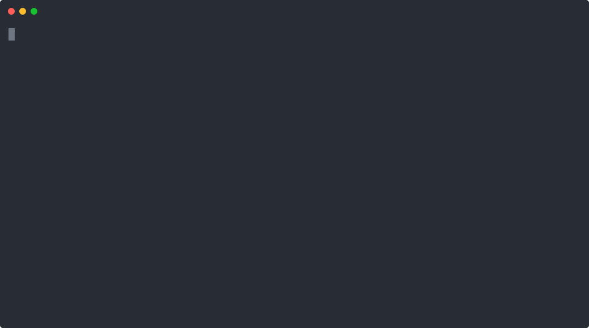

# Demo: a real job on a local cluster

GitHub Actions Gateway (GAG) in 30 seconds: a real GitHub Actions job runs in a **worker pod that exists only while the job runs**, then disappears.
No runner sits idle.
Nothing here is staged; every line was captured from a real run on a local [kind](https://kind.sigs.k8s.io/) cluster against **real GitHub** (a self-hosted `runs-on: e2e` workflow).

The recording assumes GAG is already installed and shows only the payoff.
See [Try it yourself](#try-it-yourself) to run it on your own cluster.

## What the demo shows

| Beat | What happens | Why it matters |
| --- | --- | --- |
| **Idle** | Before any job, the team's namespace holds only a lightweight controller and proxy: **zero worker pods**. | No idle compute (and no idle GPUs) between jobs. |
| **Run** | One `gh workflow run` triggers a job. A worker pod goes `Pending → Running → Completed`, then is **deleted on completion**. | One job → one short-lived pod; the node is freed instantly. |
| **Green** | `gh run view` shows the job succeeded on GitHub (in ~8s). | The job really ran on real GitHub, and you paid for compute only while it ran. |

## Try it yourself

- **Install GAG on your cluster.** [Getting Started](getting-started.md) covers the Helm chart, a tenant namespace and quota, the GitHub App credential Secret, and the `ActionsGateway` resource.
- **Reproduce this exact demo for free on a local kind cluster.** A step-by-step from-source guide (build the images, stand up kind, onboard a tenant, run one job) lives in the repository: [Reproduce the local-kind demo](https://github.com/actions-gateway/github-actions-gateway/blob/main/docs/development/local-kind-demo.md).

## Next steps

- [Why GAG?](why-gag.md): how GAG compares to Actions Runner Controller (ARC).
- [Architecture](design/02-architecture.md): the four-tier design behind what the demo shows.

---

*The recording is a hand-authored [asciinema](https://asciinema.org/) cast (v2) assembled from the real command outputs of a run on a local kind cluster against real GitHub, then rendered to a self-contained animated SVG.
The cast and its generator live in [`docs/assets/`](https://github.com/actions-gateway/github-actions-gateway/tree/main/docs/assets) (`demo-local-kind.cast`, `generate-demo-cast.py`).*
