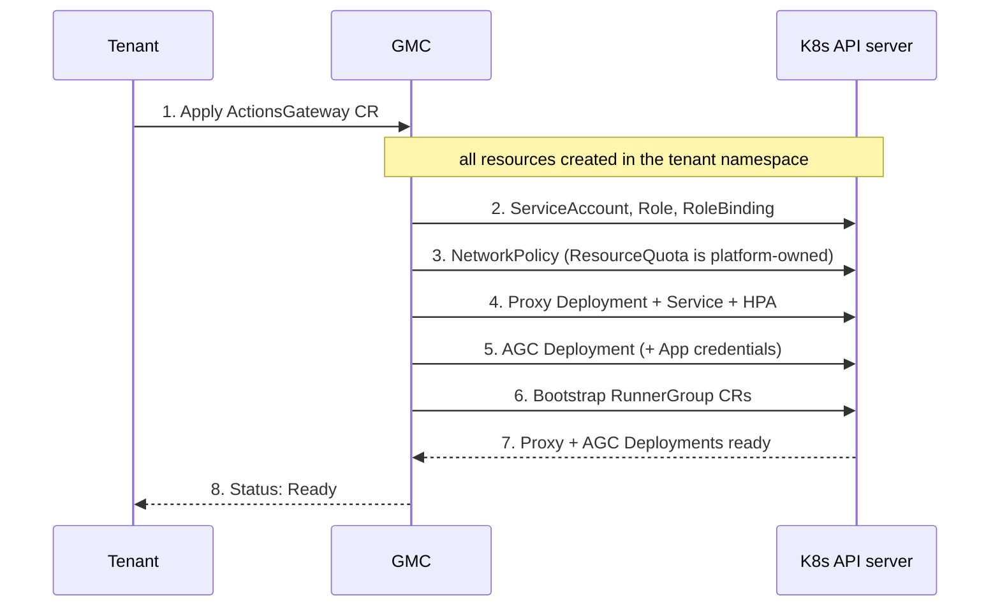
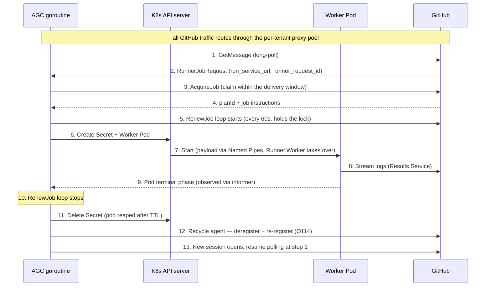
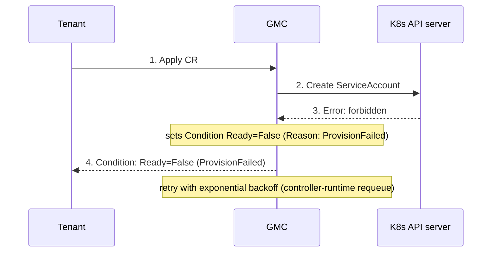
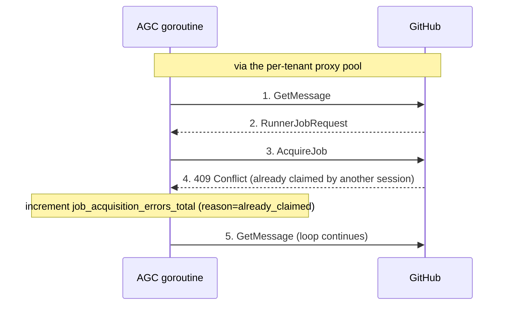
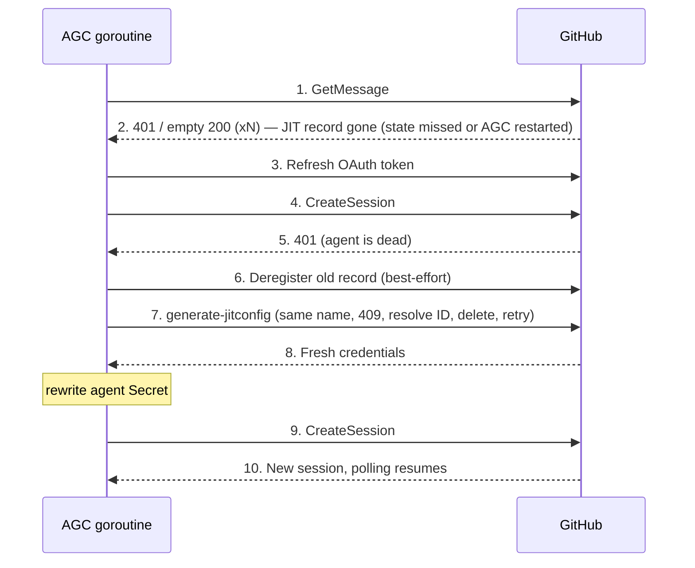
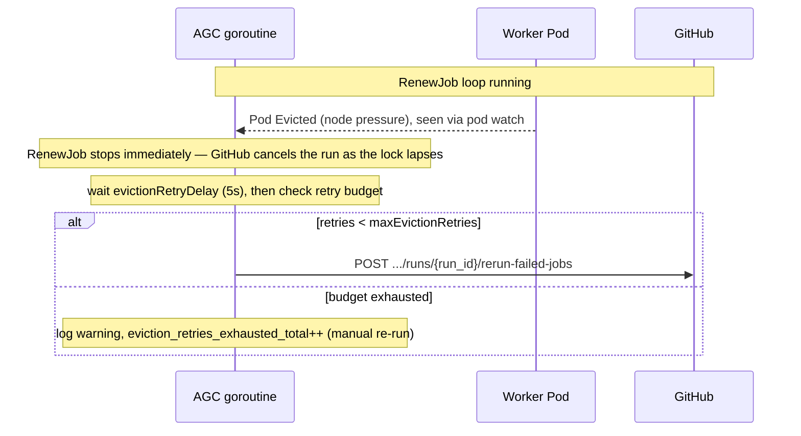
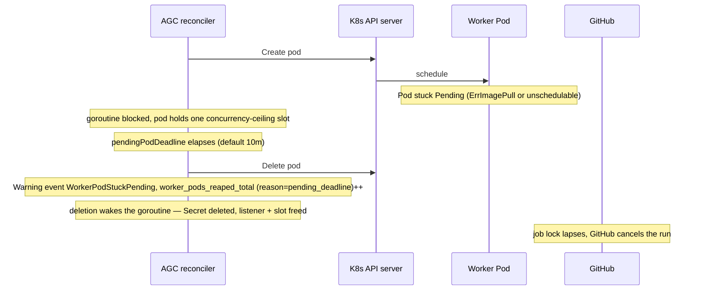
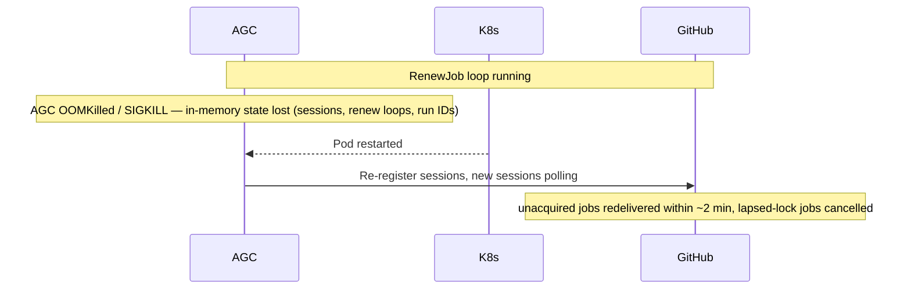

# 4. Operational Lifecycle Execution Flows

← [API & Data Contracts](03-api-contracts.md) | [Back to index](README.md) | Next: [Security →](05-security.md)

---

There are two distinct lifecycle flows: tenant provisioning (GMC) and job execution (AGC).

## 4.1. Tenant Provisioning Flow (GMC)

This flow runs once when a tenant creates an `ActionsGateway` resource in their namespace, and re-runs on any spec update.

1. **Declare:** A tenant creates an `ActionsGateway` CR in their own namespace, providing a `gitHubAppRef`, optional `proxy` scaling config, and optional initial `runnerGroups`. No cluster-admin involvement is required.
2. **RBAC:** The GMC creates a `ServiceAccount` for the AGC and a `Role`/`RoleBinding` scoped strictly to the CR's namespace. The AGC receives no cluster-level permissions.
3. **Guardrails:** A `NetworkPolicy` is applied. The NetworkPolicy permits egress to GitHub's IP ranges only from proxy pods (matched by label); the AGC and worker pods are permitted egress only to the proxy `ClusterIP` Service within the namespace. The namespace `ResourceQuota` is **platform-owned** — the platform admin provisions it out-of-band and GAG operates within it; the GMC neither creates nor mutates it (Q130).
4. **Proxy:** The GMC creates the proxy `Deployment` with `podAntiAffinity` spreading replicas across nodes, a `ClusterIP` `Service` in front of it, a `PodDisruptionBudget` with `minAvailable: 1`, and an `HorizontalPodAutoscaler` configured from `spec.proxy`. The HPA scales between `minReplicas` and `maxReplicas` targeting `targetCPUUtilizationPercentage`.
5. **Deploy:** The GMC creates the AGC `Deployment`, injecting the GitHub App credentials from the referenced Secret and setting `HTTP_PROXY`/`HTTPS_PROXY` to the proxy Service address. The worker pod template in the AGC's config also receives these env vars so all job log traffic routes through the proxy pool.
6. **Bootstrap:** Any `RunnerGroup` specs in the `ActionsGateway` CR are created as `RunnerGroup` resources in the same namespace for the AGC to reconcile.
7. **Signal:** The GMC watches both the proxy Deployment's `ReadyReplicas` and the AGC Deployment's `ReadyReplicas`, updating `ActionsGatewayStatus.ProxyReadyReplicas` and the `AGCAvailable` Condition as they become available.
8. **Report:** The `ActionsGateway` status transitions to `Ready` once both the proxy pool has at least `minReplicas` ready and the AGC is healthy.

---

## 4.2. Job Execution Flow (AGC)

This flow runs per-job inside the tenant namespace, entirely managed by the AGC.

1. **Poll:** A dedicated AGC goroutine fires a `GetMessage` request via the proxy pool. GitHub holds the connection for up to 50 seconds; returns `202 Accepted` if no job is queued.
2. **Intercept:** GitHub responds with a `RunnerJobRequest` message containing `run_service_url`, `runner_request_id`, and `billing_owner_id` in the decoded body.
3. **Lock:** The AGC immediately calls `POST {run_service_url}/acquirejob` via the proxy — before creating any Kubernetes resources — to claim the job within the 2-minute delivery window.
4. **Payload:** `acquirejob` returns the full job instructions and `planId`. The AGC decrypts the payload and extracts the single-use `ACTIONS_RUNTIME_TOKEN`.
5. **Renew:** A per-job background goroutine starts calling `POST {run_service_url}/renewjob` every 60 seconds. Each renewal extends the job lock by ~10 minutes. Pod startup time is no longer a race — the lock is already held.
6. **Stage:** The AGC commits a short-lived Kubernetes Secret containing the decrypted job payload to the tenant namespace, then creates the Ephemeral Worker Pod mounted with that Secret and `automountServiceAccountToken: false`.
7. **Handoff:** The worker pod boots, the entrypoint wrapper feeds the payload into Named Pipes, and the .NET `Runner.Worker` engine takes over.
8. **Stream:** The worker pod streams live execution logs to GitHub's Twirp Results Service via the proxy pool.
9. **Complete:** The worker container exits with code `0` on success (non-zero on workflow failure). A single event handler on the AGC's shared Pod informer observes the terminal pod phase and wakes the waiting session goroutine — detection is event-driven, not polled, so completion is noticed near-immediately regardless of how many sessions are in flight.
10. **Stop renewing:** The RenewJob goroutine detects pod completion and exits cleanly.
11. **Reclaim:** The AGC deletes the associated job Secret immediately. The completed pod is retained for `completedPodTTL` (default 5m) and then deleted by the RunnerGroup reconciler's worker-pod reaper; `completedPodTTL: 0s` deletes it immediately on completion. Both the pod and the Secret also carry a controller `OwnerReference` to the RunnerGroup, so RunnerGroup or tenant deletion cascade-deletes anything still present.
12. **Recycle (Q114):** The acquisition in step 3 consumed the agent's single-use JIT runner record, so the session is dead. The goroutine deletes it (best-effort) and re-registers the agent under its stable `<group>-<index>` name — deregister-then-recreate, resolving a `409` from a surviving record by ID lookup.
13. **Resume:** The agent Secret is rewritten with the fresh credentials and a new session opens; the same goroutine resumes polling at step 1, so listener capacity never dips.

---

## 4.3. Failure Paths

The happy-path flows above are sufficient for most operations. The following diagrams cover the most operationally significant failure modes.

### Provisioning Failure (GMC Cannot Create Resources)

The GMC reconciler is a standard `controller-runtime` reconciler. Errors are returned from `Reconcile()` and trigger automatic requeue with exponential back-off. The GMC sets a `Ready=False` condition with reason `ProvisionFailed` and a message containing the specific error on each failed attempt.

**What the tenant observes:** The `ActionsGateway` CR exists but has `Ready=False`. No AGC, proxy, or RunnerGroup resources are present. The condition message includes the underlying error.

**Resolution:** See [Troubleshooting — GMC Not Provisioning Tenant Resources](../../docs/operations/troubleshooting.md#gmc-not-provisioning-tenant-resources).

---

### Job Acquisition Failure (Broker Returns Error)

`AcquireJob` can fail with:
- `409 Conflict` — job was claimed by another session (benign race in multi-listener scenarios; the job is executing elsewhere).
- `404 Not Found` — the delivery window expired before `acquirejob` was called; GitHub will redeliver.
- `422 Unprocessable Entity` — job payload is malformed or the runner version is incompatible.

In all cases the goroutine increments `actions_gateway_job_acquisition_errors_total{reason="..."}` and continues polling on the next `GetMessage` loop iteration. A replacement listener goroutine is not spawned (no job was acquired to spawn it for), so the listener count stays the same.

---

### Stale Session (Consumed Single-Use Agent) Self-Heal

GitHub deletes a JIT runner record once it acquires a job, so a session can go stale outside the normal post-job recycle — most commonly when the AGC restarts between a job's acquisition and its recycle. The poll loop classifies the two live-observed stale signatures ([M4 §12](../plan/milestone-4.md#12-live-multi-tenant-validation-evidence-2026-06-1112)): a `401/403` triggers a heal immediately (steps 3–4 also fix plain broker-token expiry, in which case the flow stops at step 4 with no recycle); three consecutive `200`-with-empty-body responses trigger the same ladder. Only when *fresh* credentials are still rejected (step 5) is the agent re-registered (steps 6–8, `actions_gateway_agent_recycles_total{trigger="stale_session"}`). If the heal itself fails — e.g. GitHub is down — the goroutine exits with a retriable error and the multiplexer's restart backoff paces further attempts; an agent marked consumed is parked in the pool and repaired by the next reconcile rather than being handed to another listener. If instead the baseline exits *non-retriably* (version-too-old, or a credential GitHub treats as permanently dead), the multiplexer deliberately does not restart it — but the RunnerGroup reconciler requeues itself on a bounded interval while the live listener count is below the desired ceiling, so its zero-listener recovery revives the baseline within seconds rather than leaving `status.activeSessions`/`Ready` stale until the next watch event or the 10-hour resync (Q137).

**What the tenant observes (pre-fix versions):** runner list emptying after each job, `ActiveSessions` decaying, jobs queueing forever once ~`maxListeners` jobs have run. See [Troubleshooting — Sessions stuck in 401/EOF GetMessage loops](../operations/troubleshooting.md#sessions-stuck-in-401eof-getmessage-loops-tenant-throughput-decays-to-zero).

---

### Worker Pod Eviction and Auto-Retry

The AGC stops renewal immediately on detecting `Evicted` (rather than waiting for lock expiry) so that GitHub cancels the run quickly and the re-queued job enters the delivery queue as soon as possible. The `evictionRetryDelay` default of 5 seconds gives GitHub time to process the cancellation before the rerun API is called.

`maxEvictionRetries` is a hard lifetime cap per `run_id`, not a per-eviction-wave allowance: once exhausted, every subsequent eviction of that run is a no-op (counted by `eviction_retries_exhausted_total`) until the AGC restarts and the in-memory counters reset. Because a single workflow run can have several worker pods evicted simultaneously under node pressure, the check-and-increment of the per-run counter is serialized per `run_id`, so concurrent evictions can never collectively exceed the budget.

---

### Stuck-Pending Worker Pod

A worker pod that never leaves `Pending` — unpullable `workerImage`, unschedulable `podTemplate` constraints, or an exhausted node pool — would otherwise hold a concurrency-ceiling slot forever: the ceiling counts Pending pods and the session goroutine blocks until the pod terminates or disappears. The RunnerGroup reconciler's worker-pod reaper deletes any worker pod that has been Pending longer than `pendingPodDeadline` (default 10m, per-RunnerGroup). Deletion is treated as completion by the Pod-informer handler, so the session goroutine wakes, deletes the job Secret, and releases its listener and slot. The job itself was never started, so its lock lapses and GitHub cancels the run — the deadline is a capacity-protection mechanism, not a retry mechanism. Operators on clusters with slow legitimate scheduling (e.g. autoscaled GPU node pools) should raise `pendingPodDeadline` above their worst-case node-provisioning time. See the [troubleshooting runbook](../operations/troubleshooting.md#worker-pod-reaped-while-pending-workerpodstuckpending) for diagnosis.

---

### AGC Crash Mid-Job

**What GitHub observes:** Sessions are dropped (no `DELETE /sessions` sent — the process was killed). GitHub waits for session TTL before redelivering unacquired jobs. For jobs whose `renewjob` lock window expires before the AGC restarts, GitHub cancels the run. These require manual re-run.

**What the AGC does on restart:** Reconnects sessions from scratch. The in-memory retry counter state for evictions is lost; the `maxEvictionRetries` budget resets for all jobs.

**Recovery target:** Sessions restored within ~seconds of pod startup. Unacquired jobs redelivered within ~2 minutes. See the `SessionReacquisition` SLO in [Appendix A](appendix-a-capacity-slos.md).

---

← [API & Data Contracts](03-api-contracts.md) | [Back to index](README.md) | Next: [Security →](05-security.md)
