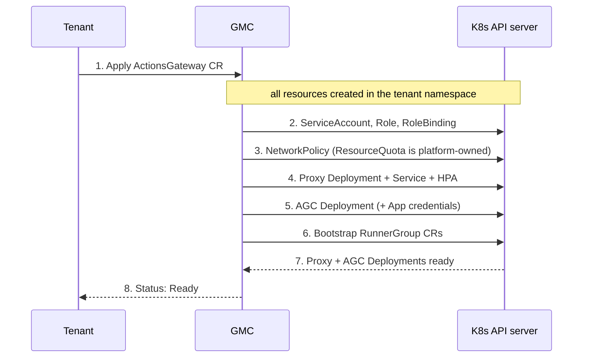
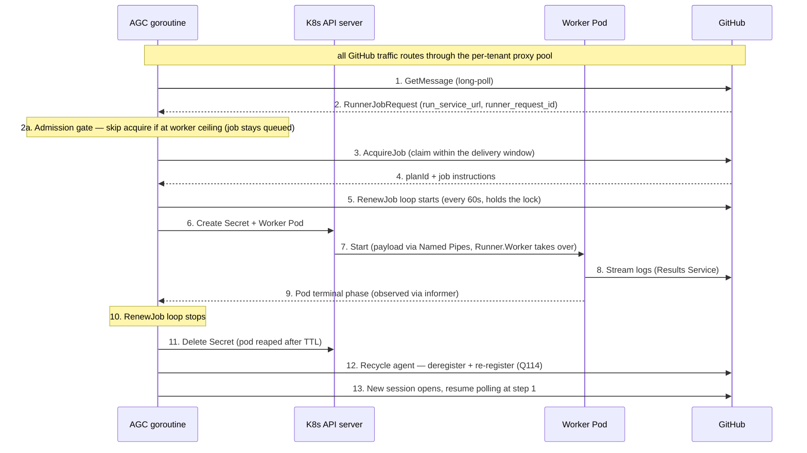
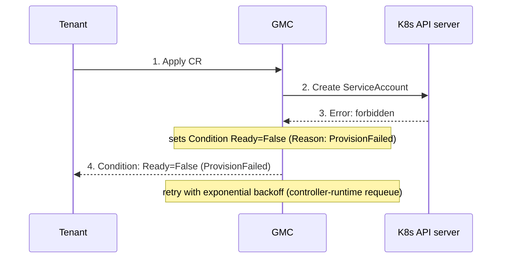
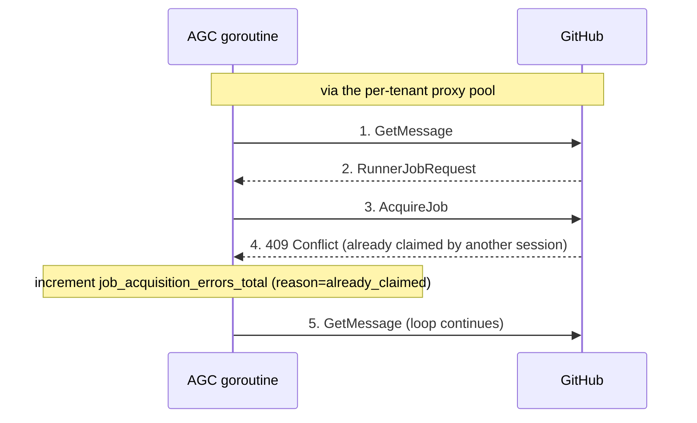
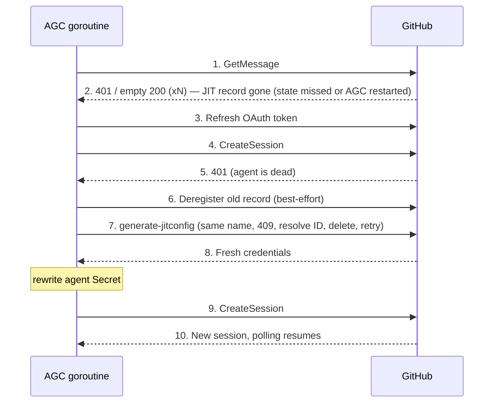
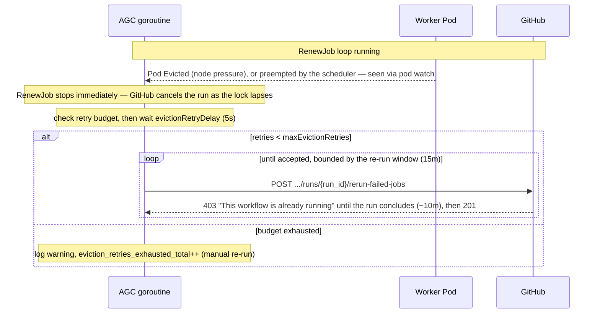
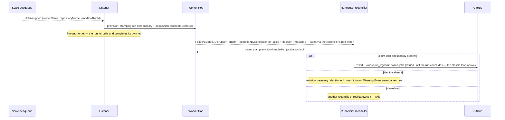
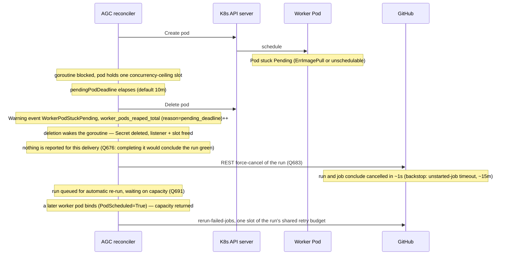
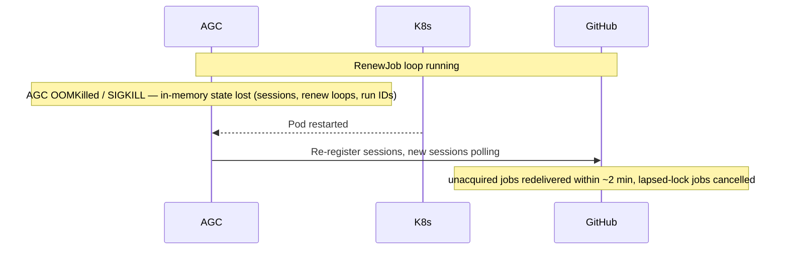

# 4. Operational Lifecycle Execution Flows

← [API & Data Contracts](03-api-contracts.md) | [Back to index](README.md) | Next: [Security →](05-security.md)

---

There are two distinct lifecycle flows: tenant provisioning (GMC) and job execution (AGC).

## 4.1. Tenant Provisioning Flow (GMC)

This flow runs once when a tenant creates an `ActionsGateway` resource in their namespace, and re-runs on any spec update.


```mermaid
sequenceDiagram
    participant T as Tenant
    participant G as GMC
    participant K as K8s API server
    T->>G: 1. Apply ActionsGateway CR
    Note over G,K: all resources created in the tenant namespace
    G->>K: 2. ServiceAccount, Role, RoleBinding
    G->>K: 3. NetworkPolicy (ResourceQuota is platform-owned)
    G->>K: 4. Proxy Deployment + Service + HPA
    G->>K: 5. AGC Deployment (+ App credentials)
    G->>K: 6. Bootstrap RunnerGroup CRs
    K-->>G: 7. Proxy + AGC Deployments ready
    G-->>T: 8. Status: Ready
```

1. **Declare:** A tenant creates an `ActionsGateway` CR in their own namespace, providing a `gitHubAppRef`, optional `proxy` scaling config, and optional initial `runnerGroups`. No cluster-admin involvement is required.
2. **RBAC:** The GMC creates a `ServiceAccount` for the AGC and a `Role`/`RoleBinding` scoped strictly to the CR's namespace. The AGC receives no cluster-level permissions.
3. **Guardrails:** A `NetworkPolicy` is applied. The NetworkPolicy permits egress to GitHub's IP ranges only from proxy pods (matched by label); the AGC and worker pods are permitted egress only to the proxy `ClusterIP` Service within the namespace. The namespace `ResourceQuota` is **platform-owned** — the platform admin provisions it out-of-band and GAG operates within it; the GMC neither creates nor mutates it (Q130).
4. **Proxy:** The GMC creates the proxy `Deployment` with `podAntiAffinity` spreading replicas across nodes, a `ClusterIP` `Service` in front of it, a `PodDisruptionBudget` with `minAvailable: 1`, and an `HorizontalPodAutoscaler` configured from `spec.proxy`. The HPA scales between `minReplicas` and `maxReplicas` targeting `targetCPUUtilizationPercentage`.
5. **Deploy:** The GMC creates the AGC `Deployment`, injecting the GitHub App credentials from the referenced Secret and setting `HTTP_PROXY`/`HTTPS_PROXY` to the proxy Service address. The worker pod template in the AGC's config also receives these env vars so all job log traffic routes through the proxy pool.
6. **Bootstrap:** Any `RunnerGroup` specs in the `ActionsGateway` CR are created as `RunnerGroup` resources in the same namespace for the AGC to reconcile. This reconciles to the desired set, not just additively: after applying the groups currently in `spec.runnerGroups`, the GMC prunes any `RunnerGroup` it owns (matched by owner labels) that is no longer in the spec, so removing or reordering an entry deletes the orphaned `RunnerGroup` — and cascades to its listeners and worker pods via the AGC's RunnerGroup cleanup — rather than leaving it running until the whole `ActionsGateway` is deleted (Q101). Pruning keys on the owner labels, not the slice index, so a reorder never orphans a group.
7. **Signal:** The GMC watches both the proxy Deployment's `ReadyReplicas` and the AGC Deployment's `ReadyReplicas`, updating `ActionsGatewayStatus.ProxyReadyReplicas` and the `AGCAvailable` Condition as they become available.
8. **Report:** The `ActionsGateway` status transitions to `Ready` once both the proxy pool has at least `minReplicas` ready and the AGC is healthy.

### 4.1.1. Tenant Teardown and Child Reclamation

Deleting the `ActionsGateway` reclaims every resource provisioned above through **two independent mechanisms, deliberately layered**:

- **The cleanup finalizer is the primary path.** It is ordered and fail-closed (Q125): the GMC deletes the `RunnerGroup`s first and waits for them to be gone — so listeners and worker pods drain before the AGC `Deployment` and its credentials are removed — then deletes the remaining children, and only removes the finalizer once *every* delete is confirmed. A delete that keeps failing retains the finalizer and requeues rather than abandoning a live, credentialed AGC. It also reaches objects the current reconciler no longer applies (the pre-v0.X per-tenant `Role`, the legacy `actions-gateway` `NetworkPolicy`), which nothing else would reclaim.
- **Owner-reference cascade garbage collection is the backstop.** Every namespaced child the GMC applies carries a controller `OwnerReference` to its `ActionsGateway` — in both `v1alpha1` and `v2alpha1` (Q394). Because a `ResourceQuota`-style platform-owned object is never a GMC child, and because both API versions place their children in the CR's own namespace, the reference is always valid. It costs nothing in the normal path (the CR is not removed from etcd until the finalizer clears, so the ordered drain always runs first) and it is what makes an operator force-removing the finalizer a recoverable mistake rather than a leak of credentialed `ServiceAccount`s, the AGC `RoleBinding`, the egress `NetworkPolicy`s, and the proxy `HPA`/`PDB`/`Service` into a namespace the tenant still controls.

The one intentional exception is a **cluster-scoped** child: a namespaced `ActionsGateway` cannot own one (the apiserver rejects the cross-scope reference and never collects it), so `v2alpha1`'s per-gateway `ClusterRoleBinding` is un-owned and reclaimed by the finalizer alone. Any new cluster-scoped child inherits that constraint and must be deleted explicitly in `reconcileDelete`.

**v2 needs a third mechanism for the tenant's worker pods** (Q547). The ordered drain above works in v1 because `RunnerGroup`s *are* the gateway's children: deleting them first cascades to their worker pods. v2 decomposed them into standalone `RunnerSet`s that only reference the gateway and are deliberately **not** deleted with it — a tenant re-applies the gateway and its sets resume — which leaves worker pods owned by a live object whose only reaper is about to be torn down. Reaping cannot ride the AGC's SIGTERM either: `reconcileDelete` deletes the AGC's `RoleBinding` and `ServiceAccount` within milliseconds of its `Deployment`, so a shutdown-time reap would find its authorization revoked and its bound token invalid. So the two controllers split it:

1. The AGC watches its `ActionsGateway` already, for reference resolution. A `deletionTimestamp` on it makes the RunnerSet reconciler stop both acquisition tiers and delete every worker pod under `reason="gateway_deleted"` — while it still holds its full tenant grant, because the GMC has not deleted anything yet.
2. Teardown's **first** act is to check `status.activeJobs`/`pendingJobs` across the bound sets and requeue while any are non-zero, before the first `del`. The counts fall as soon as the AGC issues its deletes (a pod carrying a deletion timestamp is finished by the kubelet with no controller involved), so the healthy path costs one requeue. A 90-second deadline measured from the CR's own `deletionTimestamp` — stateless, so it survives a GMC restart mid-teardown — bounds the case where no AGC is running to reap at all; past it teardown proceeds and emits a `WorkerDrainTimeout` Warning naming what it is leaving to the kubelet's `maxWorkerLifetime` deadline.

The trigger is a *terminating* gateway, never a missing one: a gateway that is gone is both the resting state after teardown and the gap between a delete and a re-apply, so reaping there would destroy live workers on a recreate.

---

## 4.2. Job Execution Flow (AGC)

This flow runs per-job inside the tenant namespace, entirely managed by the AGC.

> **This is the classic acquisition flow.** A `RunnerSet` with
> `spec.acquisitionProtocol: ScaleSet` — the default, and `v2beta1`'s only option —
> does not run steps 2a–5 as written: the runner pulls and completes its own job
> through its own session, and the AGC advertises a single capacity integer
> (`X-ScaleSetMaxCapacity`) instead of deciding per delivered job. Two consequences
> are called out where they arise. Eviction auto-retry is ported to this tier
> (Q417, [below](#on-the-scale-set-tier-q417)), as is the admission ladder of step 2a
> (Q443, [below](#the-ladder-as-an-integer-scale-set-tier-q443)) — both were
> classic-only, which the `v2.0.0` removal of classic acquisition would have turned
> into a silent capability deletion.


```mermaid
sequenceDiagram
    participant A as AGC goroutine
    participant K as K8s API server
    participant W as Worker Pod
    participant GH as GitHub
    Note over A,GH: all GitHub traffic routes through the per-tenant proxy pool
    A->>GH: 1. GetMessage (long-poll)
    GH-->>A: 2. RunnerJobRequest (run_service_url, runner_request_id)
    Note over A: 2a. Admission gate — skip acquire if at worker ceiling (job stays queued)
    A->>GH: 3. AcquireJob (claim within the delivery window)
    GH-->>A: 4. planId + job instructions
    A->>GH: 5. RenewJob loop starts (every 60s, holds the lock)
    A->>K: 6. Create Secret + Worker Pod
    K->>W: 7. Start (payload via Named Pipes, Runner.Worker takes over)
    W->>GH: 8. Stream logs (Results Service)
    W-->>A: 9. Pod terminal phase (observed via informer)
    Note over A: 10. RenewJob loop stops
    A->>K: 11. Delete Secret (pod reaped after TTL)
    A->>GH: 12. Recycle agent — deregister + re-register (Q114)
    A->>GH: 13. New session opens, resume polling at step 1
```

1. **Poll:** A dedicated AGC goroutine fires a `GetMessage` request via the proxy pool. GitHub holds the connection for up to 50 seconds; returns `202 Accepted` if no job is queued.
2. **Intercept:** GitHub responds with a `RunnerJobRequest` message containing `run_service_url`, `runner_request_id`, and `billing_owner_id` in the decoded body.
2a. **Admit (Q59, #784, Q405, Q406):** Before claiming the job, the goroutine consults the pre-acquisition admission gate, which asks three questions in order. **Quota:** can the namespace `ResourceQuota` admit one more worker pod right now (`hard − used` against this owner's worker footprint)? **Capacity:** if the owner opted into a capacity gate, can the cluster currently *place* one more worker pod of this shape? **Ceiling:** is the in-memory, per-RunnerGroup reservation counter below the worker ceiling (`maxWorkers` / the maximum `priorityTiers` threshold)? A no from any of them **skips `acquirejob`**, increments `actions_gateway_jobs_admission_rejected_total{reason}` (`quota`, `capacity`, or `ceiling`), and resumes polling at step 1 — the job stays queued at GitHub and is redelivered to a sibling session with capacity, rather than acquired-then-dropped. When the gate admits, it reserves a slot held until the job completes (step 11), then proceeds to step 3. The two observed rungs fail open and reserve nothing, which is why they precede the ceiling; the reservation is fail-safe soft state (reset on AGC restart). The provisioner's post-acquire ceiling check and quota-retry loop (step 6) remain the authoritative backstops.

   **Tier scope.** This *per-delivered-job* form of the gate is wired from `AdmitFor` (v1 `RunnerGroup`) and the classic branch of the v2 `RunnerSet` reconciler; `reconcileScaleSetListener` returns before it. A `ScaleSet` set walks the same ladder once per long-poll and states the result as one integer — see [The ladder as an integer](#the-ladder-as-an-integer-scale-set-tier-q443). Every rung must exist in both forms; a rung added to only one ships to only one tier, which is how the quota rung came to be classic-only until Q443.

   **Why quota gates unconditionally and placeability is opt-in.** The quota rung and the scheduler's `WorkersUnschedulable` verdict look symmetrical and are not. A `ResourceQuota` rejection is never an autoscaler input, so declining to claim forfeits no capacity and self-clears as in-flight jobs release headroom. A Pending unschedulable pod, by contrast, *may be* the request for a node: on an elastic cluster, gating on it would suppress the signal cluster-autoscaler needs and starve the tenant exactly when scale-up would have rescued it, while on a fixed-size cluster nothing is waiting on that pod and the same verdict is pure waste. The asymmetry belongs to the cluster, not to the signal, so the owner asserts which one it has via `spec.capacityGate.mode` (default `Off`) and the AGC never auto-detects it — a wrong detection starves a tenant. Rationale: [Appendix D §D.8](appendix-d-alternatives-considered.md#d8-gating-intake-on-capacity-which-signals-are-safe-to-gate-on).

   **Two inputs, from two parties (Q470).** The *mode* is the tenant's `spec.capacityGate.mode` (`Off`|`Observe`) — how hard should this set try not to claim work it cannot run. The *signal* follows from the platform operator's `ActionsGateway.spec.clusterCapacity.nodeAutoscaling`, because which reading of an unschedulable pod is sound is a property of the cluster, identical for every set in it. Splitting them is what makes the one harmful misconfiguration — gating on the scheduler's verdict where an autoscaler was about to add a node — **unrepresentable** rather than merely documented, and it stops a tenant being asked to speak for infrastructure they may not own.

   **The two signals.** With `nodeAutoscaling: Absent` the gate reads the scheduler's verdict, sound because nothing is waiting on those pods. With `Present` (the default) it reads the *autoscaler's own declination* — cluster-autoscaler's `NotTriggerScaleUp`, or Karpenter's `FailedScheduling` from a non-scheduler reporter — recorded as an Event on a stuck worker pod, because only the autoscaler saying it will not act is evidence that no node is coming. Both feed the identical rung, condition, and metric label. `Present` is the default deliberately: it can only ever *under*-gate, so a cluster whose operator never set the field keeps today's behavior. The reporter check is load-bearing, because `FailedScheduling` is also kube-scheduler's own reason for every ordinary transient placement failure. So is recency: the verdict is the newest relevant event, so an autoscaler that declined and then scaled up reopens the gate rather than being remembered as a no. Recency is deliberately asymmetric — one autoscaler loop can record both verdicts for one pod milliseconds apart, so a declination counts as superseding a scale-up only from more than a second later, and a closer pair resolves open. Events are read uncached, field-selected to one pod, only for pods already stuck past the scheduling grace, and bounded per reconcile — there is no Event informer, and a healthy set costs zero reads. Detail: [Appendix H §H.7](appendix-h-v2-api-decomposition.md#h7-reference-integrity--runtime-conditions-not-admission).

   **The capacity rung self-resolves through a probe, and that is what keeps it safe.** It reads the `WorkerCapacityDeclined` condition, which is derived from the *existence* of a stuck worker pod — and because the reaper deletes exactly that pod at `pendingPodDeadline`, the condition does not clear on the reap: it **latches** as `AwaitingProbe` and admits exactly one probe job (Q512). The probe's pod is the fresh evidence, in whichever direction it lands — it schedules and the gate clears completely, or it sticks and the live verdict returns. A burst of *N* jobs that would each have been claimed and cancelled becomes roughly one wasted claim per deadline window — a bound on the rate, not an elimination. The latch is what makes that rate hold on the scale-set tier too, where capacity is an integer per poll rather than a decision per job: clearing on the reap would restore the whole advertisement each window (measured as a no-op — [plan §9e](../plan/capacity-aware-intake.md#9e-what-the-dogfood-run-measured-q469)). Nothing here removes the need for `pendingPodDeadline` and the reaper.
3. **Lock:** The AGC immediately calls `POST {run_service_url}/acquirejob` via the proxy — before creating any Kubernetes resources — to claim the job within the 2-minute delivery window.
4. **Payload:** `acquirejob` returns the full job instructions and `planId`. The AGC decrypts the payload and extracts the single-use `ACTIONS_RUNTIME_TOKEN`.
5. **Renew:** A per-job background goroutine starts calling `POST {run_service_url}/renewjob` every 60 seconds. Each renewal extends the job lock by ~10 minutes. Pod startup time is no longer a race — the lock is already held.
6. **Stage:** The AGC commits a short-lived Kubernetes Secret containing the decrypted job payload to the tenant namespace, then creates the Ephemeral Worker Pod mounted with that Secret and `automountServiceAccountToken: false`.
7. **Handoff:** The worker pod boots, the entrypoint wrapper feeds the payload into Named Pipes, and the .NET `Runner.Worker` engine takes over. The wrapper stays resident as PID 1 and relays SIGTERM/SIGINT down to the engine, so a pod termination (eviction, node drain) reaches the process that can actually abort the job and report it (Q385). Note the precondition: the relay carries a *pod* termination. A run **cancelled at GitHub** does not terminate the pod — the cancellation arrives on the AGC's broker session and nothing forwards it to the worker, so the runner executes its remaining steps while GitHub concludes the job at its own ~5-minute cancellation grace (measured 2026-07-29: a `sleep 600` job ran the full 600s after its run was cancelled). [Q501](../STATUS.md#Q501) carries that gap; what it has closed so far is the *actuator* — when the AGC does give up on a job (step 5's lock loss), the worker pod is now deleted rather than left running to the `maxWorkerLifetime` cap. **The gap is specific to this tier.** On **ScaleSet** the listener holds a message queue for the whole job, and a cancelled run puts a terminal `JobCompleted` on it — measured live at ~0.2 s for a job with no runner attached (Q468) — which stamps `actions-gateway.com/job-completed-at` on the worker and hands it to the reaper's five-minute `Running` grace (step 11, Q420). So the ScaleSet worst case is GitHub's cancellation grace plus the reap grace, against classic's *whole remaining job* bounded only by `maxWorkerLifetime`. Detail: [q501-cancel-relay.md](../plan/q501-cancel-relay.md).
8. **Stream:** The worker pod streams live execution logs to GitHub's Twirp Results Service via the proxy pool.
9. **Complete:** The worker container exits with code `0` on success (non-zero on workflow failure). A single event handler on the AGC's shared Pod informer observes the terminal pod phase and wakes the waiting session goroutine — detection is event-driven, not polled, so completion is noticed near-immediately regardless of how many sessions are in flight.
10. **Stop renewing:** The RenewJob goroutine detects pod completion and exits cleanly.
11. **Reclaim:** The AGC deletes the associated job Secret immediately. The completed pod is retained for `completedPodTTL` (default 5m) and then deleted by the RunnerGroup reconciler's worker-pod reaper; `completedPodTTL: 0s` deletes it immediately on completion. Both the pod and the Secret also carry a controller `OwnerReference` to the RunnerGroup, so RunnerGroup or tenant deletion cascade-deletes anything still present.

    On the **ScaleSet** protocol the same invariant holds — a credential-bearing per-job Secret never outlives its job — but the reclaim point differs, because the AGC does not wait on the worker there. The provisioner is fire-and-forget: any exit that fails *before* the worker pod exists deletes the Secret it just staged (a replay whose Secret an earlier delivery staged leaves it alone — that delivery's pod may be mounting it), and in steady state the Secret is deleted when the scale-set listener sees the job's terminal `JobCompleted` on its queue. Because the queue replays messages the listener has not deleted to a re-created session, an AGC that crashes between a job's completion and its Secret delete reclaims it on restart. That property survives the Q583 delete-ack precisely because the delete waits on the reclaim: a completion whose Secret delete failed is not treated as concluded, so its message stays in the queue and the next session retries it. A reclaim that fails outright is logged and falls back to the `OwnerReference` cascade-GC.
12. **Recycle (Q114):** The acquisition in step 3 consumed the agent's single-use JIT runner record, so the session is dead. The goroutine deletes it (best-effort) and re-registers the agent under its stable `<group>-<index>` name — deregister-then-recreate, resolving a `409` from a surviving record by ID lookup.
13. **Resume:** The agent Secret is rewritten with the fresh credentials and a new session opens; the same goroutine resumes polling at step 1, so listener capacity never dips.

### The ladder as an integer (scale-set tier, Q443)

A `ScaleSet` set never reaches step 2a, because it is never offered a job to decline: it states, once per long-poll, how many jobs GitHub may keep assigned to it, as the `X-ScaleSetMaxCapacity` header. GitHub then holds `totalAssignedJobs` at or below that value, so the *same* ladder produces the *same* outcome — a job that would have been declined is simply left queued — through an integer rather than a per-job boolean.

The advertised number is the **minimum** of the ladder's rungs, recomputed every poll (so a spec edit or a quota change takes effect without an AGC restart):

| Rung | Contribution | Fail-open value |
|---|---|---|
| Ceiling (Q59) | the max `priorityTiers` threshold, else `maxWorkers`, else `10` | — (the `10` default *is* the fallback) |
| Quota (#784, Q443) | this set's non-terminal worker pods **+** how many more the namespace `ResourceQuota` can admit | no bound (the ceiling stands) |
| Capacity (Q405, Q406, Q512) | this set's non-terminal worker pods, while its capacity gate is declining — no room for one more; **plus one probe slot** while the gate is latched (`AwaitingProbe`) with no probe pod outstanding | no bound (gate `Off`, an unimplemented mode, nothing declining, or nothing readable) |

Three properties follow, and they are why this is not merely the classic gate in different clothing:

* **Nothing is spent to discover the limit.** The classic gate declines a job that was already delivered; here the job is never assigned, so no single-use JIT runner record is consumed and no GitHub job lock is taken out on a pod that cannot be created.
* **The quota rung is a total, not a delta.** Headroom answers "how many *more* fit"; the header wants "how many at once", so the set's own in-flight worker pods — already inside the quota's `used` — are added back. Deliberately the pod count and not GitHub's `totalAssignedJobs`: the two diverge across an assignment the AGC has not provisioned yet, and biasing low only delays a job where biasing high would reproduce the claim-and-stall.
* **Recovery is a poll, not a job.** Classic re-decides per delivered job; this decides once per poll for the whole set, so restored headroom reopens assignment within one long-poll interval (~50s) rather than immediately.

Because every rung can only *lower* the number, a rung that cannot read what it needs (no quota, an unreadable quota, an unresolved template) contributes no bound and the set advertises its declared ceiling — exactly the behavior that predates this rung. The provisioner's post-create ceiling check and quota-retry loop remain the backstops for the races an advertised integer cannot close (a sibling AGC, a stale `.status.used`).

**What an operator sees.** `actions_gateway_scaleset_advertised_capacity` is the number most recently advertised, and `actions_gateway_scaleset_capacity_withheld{reason}` attributes the gap to the rung that took it (`quota`, `capacity`). The per-job `actions_gateway_jobs_admission_rejected_total` is structurally unreachable on this tier — there is no rejected job to count — so these two gauges are its counterpart, alongside the `WorkerQuotaPressure`/`WorkerQuotaExceeded` and `WorkerCapacityDeclined` conditions the set publishes.

---

## 4.3. Failure Paths

The happy-path flows above are sufficient for most operations. The following diagrams cover the most operationally significant failure modes.

### Provisioning Failure (GMC Cannot Create Resources)


```mermaid
sequenceDiagram
    participant T as Tenant
    participant G as GMC
    participant K as K8s API server
    T->>G: 1. Apply CR
    G->>K: 2. Create ServiceAccount
    K-->>G: 3. Error: forbidden
    Note over G: sets Condition Ready=False (Reason: ProvisionFailed)
    G-->>T: 4. Condition: Ready=False (ProvisionFailed)
    Note over G: retry with exponential backoff (controller-runtime requeue)
```

The GMC reconciler is a standard `controller-runtime` reconciler. Errors are returned from `Reconcile()` and trigger automatic requeue with exponential back-off. The GMC sets a `Ready=False` condition with reason `ProvisionFailed` and a message containing the specific error on each failed attempt.

**What the tenant observes:** The `ActionsGateway` CR exists but has `Ready=False`. No AGC, proxy, or RunnerGroup resources are present. The condition message includes the underlying error.

**Resolution:** See [Troubleshooting — GMC Not Provisioning Tenant Resources](../operations/troubleshooting.md#gmc-not-provisioning-tenant-resources).

---

### Job Acquisition Failure (Broker Returns Error)


```mermaid
sequenceDiagram
    participant A as AGC goroutine
    participant GH as GitHub
    Note over A,GH: via the per-tenant proxy pool
    A->>GH: 1. GetMessage
    GH-->>A: 2. RunnerJobRequest
    A->>GH: 3. AcquireJob
    GH-->>A: 4. 409 Conflict (already claimed by another session)
    Note over A: increment job_acquisition_errors_total (reason=already_claimed)
    A->>GH: 5. GetMessage (loop continues)
```

`AcquireJob` can fail with:
- `409 Conflict` — job was claimed by another session (benign race in multi-listener scenarios; the job is executing elsewhere).
- `404 Not Found` — the delivery window expired before `acquirejob` was called; GitHub will redeliver.
- `422 Unprocessable Entity` — job payload is malformed or the runner version is incompatible.

In all cases the goroutine increments `actions_gateway_job_acquisition_errors_total{reason="..."}` and continues polling on the next `GetMessage` loop iteration. A replacement listener goroutine is not spawned (no job was acquired to spawn it for), so the listener count stays the same.

---

### Stale Session (Consumed Single-Use Agent) Self-Heal


```mermaid
sequenceDiagram
    participant A as AGC goroutine
    participant GH as GitHub
    A->>GH: 1. GetMessage
    GH-->>A: 2. 401 / empty 200 (xN) — JIT record gone (state missed or AGC restarted)
    A->>GH: 3. Refresh OAuth token
    A->>GH: 4. CreateSession
    GH-->>A: 5. 401 (agent is dead)
    A->>GH: 6. Deregister old record (best-effort)
    A->>GH: 7. generate-jitconfig (same name, 409, resolve ID, delete, retry)
    GH-->>A: 8. Fresh credentials
    Note over A: rewrite agent Secret
    A->>GH: 9. CreateSession
    GH-->>A: 10. New session, polling resumes
```

GitHub deletes a JIT runner record once it acquires a job, so a session can go stale outside the normal post-job recycle — most commonly when the AGC restarts between a job's acquisition and its recycle. The poll loop classifies the two live-observed stale signatures ([M4 §12](../plan/milestone-4.md#12-live-multi-tenant-validation-evidence-2026-06-1112)): a `401/403` triggers a heal immediately (steps 3–4 also fix plain broker-token expiry, in which case the flow stops at step 4 with no recycle); three consecutive `200`-with-empty-body responses trigger the same ladder. Only when *fresh* credentials are still rejected (step 5) is the agent re-registered (steps 6–8, `actions_gateway_agent_recycles_total{trigger="stale_session"}`).

If the heal itself fails — e.g. GitHub is down — the goroutine exits with a retriable error and the multiplexer's restart backoff paces further attempts; an agent marked consumed is parked in the pool and repaired by the next reconcile rather than being handed to another listener.

If instead the baseline exits *non-retriably* (version-too-old, or a credential GitHub treats as permanently dead), the multiplexer deliberately does not restart it — but the RunnerGroup reconciler requeues itself on a bounded interval while the live listener count is below the desired ceiling, so its zero-listener recovery revives the baseline within seconds rather than leaving `status.activeSessions`/`Ready` stale until the next watch event or the 10-hour resync (Q137).

**What the tenant observes (pre-fix versions):** runner list emptying after each job, `ActiveSessions` decaying, jobs queueing forever once ~`maxListeners` jobs have run. See [Troubleshooting — Sessions stuck in 401/EOF GetMessage loops](../operations/troubleshooting.md#sessions-stuck-in-401eof-getmessage-loops-tenant-throughput-decays-to-zero).

---

### Worker Pod Eviction and Auto-Retry

> **Both acquisition tiers, by two different routes.** The flow below is the classic
> `provision()` path, which blocks on the worker pod's terminal phase.
> `ProvisionScaleSetWorker` is fire-and-forget by design — the runner pulls and
> completes its own job — so it observes nothing, and until Q417 an evicted
> `ScaleSet` worker got no rerun at all. That mattered because `ScaleSet` is the
> default protocol (Q264 P5) and the only one `v2beta1` offers, so the capability
> covered only the *deprecated* tier. The port relocates both of the classic path's
> inputs onto the worker pod; see
> [On the scale-set tier](#on-the-scale-set-tier-q417) below.


```mermaid
sequenceDiagram
    participant A as AGC goroutine
    participant W as Worker Pod
    participant GH as GitHub
    Note over A,GH: RenewJob loop running
    W-->>A: Pod Evicted (node pressure), or preempted by the scheduler — seen via pod watch
    Note over A: RenewJob stops immediately — GitHub cancels the run as the lock lapses
    Note over A: check retry budget, then wait evictionRetryDelay (5s)
    alt retries < maxEvictionRetries
        loop until accepted, bounded by the re-run window (15m)
            A->>GH: POST .../runs/{run_id}/rerun-failed-jobs
            GH-->>A: 403 "This workflow is already running" until the run concludes (~10m), then 201
        end
    else budget exhausted
        Note over A: log warning, eviction_retries_exhausted_total++ (manual re-run)
    end
```

Three disruptions reach this flow, and each is detected differently:

* **Kubelet node-pressure eviction** leaves the pod `PodFailed` with `Status.Reason: Evicted`.
* **kube-scheduler preemption** — what a `priorityTiers` `PriorityClass` drives — instead *deletes* the victim after stamping a `DisruptionTarget` condition with reason `PreemptionByScheduler`, so it is recognised by that condition, which travels out of the pod wait alongside the phase (Q497).
* **External graceful deletion** — a `kubectl drain` or a bare `kubectl delete pod` — is recognised by the pod's `deletionTimestamp` being set at the moment its terminal phase publishes **and** the deletion *request* — `deletionTimestamp` less the grace period it carries — predating the container's recorded exit, which also travels out of the pod wait. The AGC's own deletions are excluded by the `actions-gateway.com/deletion-reason` stamp written before each of them (Q502).

See [Which disruptions are recovered](#which-disruptions-are-recovered-and-which-are-not) for the full boundary.

The AGC stops renewal immediately on detecting any of these, so the outstanding lock starts lapsing at once and GitHub concludes the run when it expires: within the remaining lock window, at worst ~10 minutes from the last renewal (the lock TTL — see `RenewJobResponse.LockedUntil` in `broker/types.go`).

The AGC waits `evictionRetryDelay` (default 5 seconds) and then calls the rerun API — **retrying while GitHub refuses with `403 This workflow is already running`**, the answer every re-run gets until GitHub has concluded the original run (Q503). The retries are paced at a fixed 30-second interval inside a 15-minute re-run window, sized past the lock TTL bound above; the whole refusal-spanning recovery holds **one** slot of the retry budget. A re-run still refused when the window closes, or refused with anything other than the still-running message, is terminal: `actions_gateway_eviction_rerun_failures_total` increments and an `EvictionRerunFailed` Warning Event names the run needing a manual re-run.

The call addresses `GITHUB_API_BASE_URL` — the same endpoint the installation token was minted against — resolved through the one helper the token exchange uses so the two cannot drift. Before Q504 it defaulted past a configured GHES endpoint to `api.github.com`, so on GHES the call failed with a 401 before it could reach the refusal above.

**Both halves of that recovery — how long GitHub takes to conclude the run, and the refusal window the retry loop exists to absorb — are measured against live GitHub, on both acquisition tiers (Q396).** A worker killed by a real kubelet eviction, on a job carrying no `timeout-minutes` to confound the timing, saw GitHub conclude the job `failure` **9m36s** after the kill — consistent with the lock TTL being the mechanism, since the runner is SIGKILLed with roughly two seconds of grace and never gets its own report out.

Reproduced on the classic tier on 2026-08-03 against the published `v1.3.0` images at **9m37s**, and once on scale-set at **9m38s**, where detection runs from the owning reconciler instead (Q417). Re-measured on the scale-set tier at **9m45s** (Q657), which is the third clean observation and the best-evidenced: the worker was cross-checked against GitHub's own `runner_name` before being disrupted, and GitHub's step records show the job at `completed/failure` with the interrupted step frozen at `in_progress/null` — the runner never posted its end.

**One scale-set run disagrees and is unattributable:** a second run of the same spec on the same build concluded 17 seconds after the job started and accepted the re-run on the first call, but it predates that identity check, and a run taken afterwards proved the spec could evict a worker that was not the one executing the job. So "a kubelet ephemeral-storage eviction is not reliably ungraceful" is **unsupported rather than established** — not refuted either, since the two runs differ in exit code. What holds is that how long GitHub takes depends on whether the runner's report escapes, not on which tier detected the loss. Quote the ~10-minute figure for the case where nothing is reported; do not quote a scale-set-specific number.

The AGC originally fired the re-run exactly once, 5 seconds after the eviction — squarely inside the window GitHub refuses — so the budget was spent, `actions_gateway_eviction_retries_total` incremented, and the job was never re-run (the Q503 defect). Treating the still-running refusal as "not yet" rather than a spent attempt is what closed it, and the retry loop is measured absorbing that window: **20 paced calls before GitHub accepted** on the classic tier and on the scale-set run whose report did not escape, and **21** on the Q657 re-measurement. See [eviction-oversubscription-validation.md § Result](../plan/eviction-oversubscription-validation.md#result-measured-2026-07-29) and [§ Scale-set result](../plan/eviction-oversubscription-validation.md#scale-set-result-measured-2026-08-03).

Contrast the *graceful* removal path, where the worker gets the full 30-second grace period and the runner does report: GitHub concludes in 15–26 seconds, and `rerun-failed-jobs` is accepted (Q459). The two paths differ by whether the report escapes, and that is what sets both the latency and whether recovery is even possible.

**A preemption is on the graceful side of that line, so the refusal window barely arises there.** kube-scheduler deletes its victim rather than SIGKILLing it, the SIGTERM relay gets the runner its grace period, and the job concludes in seconds rather than waiting out the lock — so the first or second re-run call is already past the refusal that an eviction's recovery must out-wait for ~10 minutes. A drain (Q502) sits on the same graceful side, with a measured conclusion latency of 15–26s — a few paced retries at most. The three causes share one code path, one budget, and one retry loop; they differ only in how long that loop runs.


`maxEvictionRetries` is a hard lifetime cap per `run_id`, not a per-disruption-wave allowance: once exhausted, every subsequent disruption of that run is a no-op (counted by `eviction_retries_exhausted_total`) until the AGC restarts and the in-memory counters reset. Because a single workflow run can have several worker pods evicted simultaneously under node pressure — or preempted together when a floor tier claims capacity — the check-and-increment of the per-run counter is serialized per `run_id`, so concurrent disruptions can never collectively exceed the budget, whatever mix of causes they are.

#### On the scale-set tier (Q417)

The flow above is the **classic** tier, where one goroutine holds the job's identity and watches its own pod. The scale-set tier provisions fire-and-forget and receives no acquired payload, so it has neither the watcher nor the identity. Both are relocated onto the worker pod, which makes the mechanism restart-safe rather than process-scoped:


```mermaid
sequenceDiagram
    participant Q as Scale-set queue
    participant L as Listener
    participant P as Worker Pod
    participant R as RunnerSet reconciler
    participant GH as GitHub
    Q-->>L: JobAssigned (ownerName, repositoryName, workflowRunId)
    L->>P: provision, stamping run-id/repository + acquisition-protocol=ScaleSet
    Note over L: fire-and-forget — the runner pulls and completes its own job
    P-->>R: Failed/Evicted, DisruptionTarget=PreemptionByScheduler, or Failed + deletionTimestamp — seen via the reconciler's pod watch
    R->>P: claim: stamp eviction-handled-at (optimistic lock)
    alt claim won and identity present
        R->>GH: POST .../runs/{run_id}/rerun-failed-jobs (retried until the run concludes — the classic loop above)
    else identity absent
        Note over R: eviction_recovery_identity_unknown_total++, Warning Event (manual re-run)
    else claim lost
        Note over R: another reconcile or replica owns it — skip
    end
```

Three properties make this equivalent rather than merely similar. The claim is stamped **before** the GitHub call, so recovery is at-most-once per disrupted pod across reconciles, restarts, and replicas — a duplicate re-run would silently spend another slot of the run's budget. The recovery scan runs **before** the worker-pod reaper in the same reconcile, so a terminal pod is never deleted before its identity is read. And the budget is the same budget, keyed by `run_id` alone: `maxEvictionRetries` bounds re-runs per run across both tiers **and both disruption causes** together, with the `tier` and `cause` metric labels splitting the reporting but not the cap.

#### Which disruptions are recovered, and which are not

Four causes reach the recovery above, and the boundary between them and everything else is the whole safety argument. Three of them re-run at once; the fourth, an abandoned never-started worker, re-runs only once capacity returns, because it was the absence of capacity that abandoned it (Q691):

| Disruption | Pod shape | Recovered | Why |
|---|---|---|---|
| Kubelet node-pressure eviction | `PodFailed` + `Status.Reason: Evicted` | ✅ | SIGKILL — nothing inside the pod reported, so the job hangs until its lock lapses |
| kube-scheduler preemption (`priorityTiers`) | Deleted, with `DisruptionTarget=True` / `PreemptionByScheduler` | ✅ (Q497) | The scheduler is the condition's only writer, so the signal is unambiguous |
| `kubectl drain` / eviction API, `kubectl delete pod` | `PodFailed` + empty reason, publishing **with** `deletionTimestamp` set | ✅ (Q502) | Measured discriminator: a cancel and a genuine failure publish the same shape with **no** mark. Gated on the mark, not on the `EvictionByEvictionAPI` condition, so a bare delete is covered too |
| The AGC's own deletions — reaper, and the job-abandoned reclaim | As above, plus the `actions-gateway.com/deletion-reason` stamp | ❌ | The AGC deletes pods it gave up on: the reaper's stuck-Pending and orphaned-Running workers, and (Q501) the worker of a job whose lock the renew loop lost, which GitHub has already redelivered to a sibling. Recovering either would turn cleanup into a re-run trigger. The stamp, written before every AGC-issued delete, is the exclusion |
| Deleted before its container ever ran | Vanishes, or publishes a transient `Failed` + mark with **no container exit record** (a drained *Pending* worker) | ✅ (Q691) | The job never ran to a reportable end, so nothing is reported for the assignment; the run is force-cancelled instead, concluding run and job `cancelled` in ~1s (GitHub's ~15-minute unstarted-job timeout is the backstop). The cancelled run then **does** accept `rerun-failed-jobs`, so it is re-run automatically once the owner places a worker pod again, on the shared retry budget. See [Stuck-Pending Worker Pod](#stuck-pending-worker-pod) (Q628/Q676/Q683/Q691) |
| Job failed on its own | `PodFailed`, empty reason, no deletion mark | ❌ | Re-running genuinely failing work is a retry loop, not a recovery |

The drain row closed later than preemption, and the reason is worth being precise about. Preemption could close first because `PreemptionByScheduler` has exactly one writer — never a human, never a failing job — so it needs no further measurement to be safe. The drain row keys on `deletionTimestamp` instead, which a human cancelling a run might plausibly also have produced; that had to be measured before it could be trusted. It was (2026-07-29): a cancelled run's worker publishes the same phase and empty reason with **no** deletion mark — nothing in the gateway deletes a cancelled run's pod — so the mark does separate a disruption from a cancel. The residual ambiguity is deliberate: an operator's bare `kubectl delete pod` of a running worker re-runs the job it interrupted, which is the drain behaviour, not a defect (see [q459-drained-worker-recovery.md](../plan/archive/q459-drained-worker-recovery.md)).

Note that the `DisruptionTarget` **condition type** alone is not the discriminator for either deleted-pod row: the eviction API stamps it too, with reason `EvictionByEvictionAPI`, and a bare `kubectl delete pod` stamps nothing. Preemption detection matches the full type/status/reason triple; drain detection keys on the deletion mark at terminal publish, ordered on both tiers against the container's recorded `finishedAt` — as the deletion *request* time, `deletionTimestamp` minus the grace period the apiserver folds into it.

The raw mark sits a whole grace period after the request, so comparing it directly recognises only a worker that ignored SIGTERM to its SIGKILL and misses every runner that shuts down cleanly — the shipped Q502 form, caught by `E2E_AGC_ScaleSetRecovery` on a real kubelet (Q519; envtest never sees the offset because unscheduled pods delete with grace collapsed to zero).

That ordering carries two exclusions at once:

* A delete issued *after* the container exited is cleanup of an already-failed pod, not a disruption.
* A deleted worker with *no* exit record never ran its job. A real kubelet publishes a transient `Failed`-with-mark even for a drained still-`Pending` pod (CI's fake-GitHub drain spec caught a mark-only rule firing on exactly that), so the absence of a terminal phase cannot be relied on to exclude it.

#### Why preemption *deletes* rather than *evicts*, and what that costs us

A recurring question, because the answer decides three things we measured and could not
change: why the worker's disruption-safety annotations did not deflect the preemption,
why adding a `PodDisruptionBudget` would not either, and why scale-set preemption
recovery cannot be made restart-safe.

**"Evict" and "delete" are not a gracefulness distinction.** The Eviction API
(`pods/<name>/eviction`) is essentially *a DELETE that checks PodDisruptionBudgets first*
and returns `429` if the budget would be violated. Both paths honour
`terminationGracePeriodSeconds`, which is why a preempted worker still receives SIGTERM
and why the Q385 relay gets the runner its grace period on that path. The real question
is therefore not "graceful or not" but **"should a PDB be able to block preemption"** —
and upstream Kubernetes deliberately answers no, for two reasons that apply with extra
force to a multi-tenant gateway:

- **Priority inversion.** If PDBs were a hard constraint on preemption, any low-priority
  workload could make itself un-preemptible by declaring a tight one. The floor tier's
  guarantee would degrade from "guaranteed runners always schedule" to "…unless someone
  downstream declared `minAvailable`." In our setting that is a cross-tenant denial of
  service: a tenant could pin a PDB over their opportunistic workers and starve another
  tenant's guaranteed GPU tier — precisely the failure the platform-owned
  `PriorityClass` allowlist exists to prevent.
- **Liveness.** The scheduler selects a victim set inside a scheduling cycle and must
  then bind the preemptor. An API call that can be refused would leave the high-priority
  pod `Pending` with no recourse and no retry that would fare better.

PDBs *are* consulted, as a soft preference: the scheduler prefers victims whose removal
violates none, and violates them when it has no alternative. The same reasoning explains
the annotations — `cluster-autoscaler.kubernetes.io/safe-to-evict: false`,
`karpenter.sh/do-not-disrupt`, and the descheduler opt-out are advisory to *those
controllers*, and kube-scheduler is not one of them. Q423 measured all of this rather
than assuming it: the worker carried every marker and was preempted anyway.

**This is not an upstream defect, and upstream did address the consumer's half of it.**
The `DisruptionTarget` condition exists exactly so a controller can tell disruption
causes apart, so keying recovery on `PreemptionByScheduler` is the sanctioned mechanism
rather than a workaround for a missing API.

**What it does cost us** is an asymmetry with no clean fix: a kubelet-evicted pod
*persists* in `PodFailed` until the reaper takes it, while a preempted pod is *deleted*.
Recovery evidence therefore survives an AGC restart on one path and not the other, which
is the root of the scale-set restart-safety residual noted above. Nothing short of
preemption leaving a tombstone would close it, so it is documented as a property of the
signal rather than tracked as a bug.

#### Why re-running a preempted job is not a double report

The original scale-set detection deliberately excluded every *deleted* pod on the
grounds that the Q385 SIGTERM relay already owns that case: the runner receives the
signal, reports its own outcome, and a second report from the gateway would duplicate
it. That argument does not carry to preemption, and the distinction is worth keeping
explicit because it is what makes recovering this path safe:

**The relay makes the job *conclude* at GitHub; it does not make the job *succeed*.**
Q459 measured the conclusion on the graceful path at live-GitHub — `failure` within
15–26s, with `rerun-failed-jobs` accepted. The run really is left failed, so the re-run
is the repair rather than a duplicate. `rerun-failed-jobs` also re-runs only a run's
*failed* jobs, so a run whose jobs all completed before the preemption landed has
nothing to re-run and GitHub rejects the call — which the existing error path logs and
drops.

**Q421 measured that exclusion on both tiers, 2026-07-27; Q459 then measured the two facts that let Q502 close it.** The report does get out on the graceful path: a drained *running* worker's relayed report reaches GitHub, the job concludes `failure` well under a minute after the disruption (15–26s across five runs), and `rerun-failed-jobs` is accepted — so an automatic re-run is available. And the shape is discriminable: a disrupted worker lands in `PodFailed` with an *empty* reason — the same shape a genuinely failing job produces — but it lands there **while carrying its `deletionTimestamp`**, which a run cancelled by a human (measured 2026-07-29: nothing in the gateway deletes a cancelled run's pod) and a genuine failure both lack. Recovery therefore keys on the deletion mark at terminal publish, ordered against the container's recorded exit — as the request time, the mark less its grace period (Q519) — on both tiers, with the reaper's own deletions excluded by the stamp it writes before deleting. What remains deliberately unrecovered is a worker deleted before its container ever ran — the drained *Pending* worker, which publishes at most a transient `Failed`-with-mark carrying no exit record — because a job that never ran to a reportable end leaves no failed job to re-run; the envtest pair (`TestAGC_Drain_ClassicWorkerEviction_DoesNotRerun`, `TestAGC_Drain_ScaleSetWorkerEviction_DoesNotRecover`) and the fake-GitHub `E2E_AGC_WorkerNodeDrain` pin that side, and `TestAGC_Drain_ClassicWorkerTerminalWithMark_Reruns` / `TestAGC_Drain_ScaleSetWorkerTerminalWithMark_Recovers` pin the recovered side. The worker pod's `safe-to-evict: false` / `do-not-disrupt` annotations still do not deflect a drain, being advisory to autoscalers and deschedulers only. The full reasoning and constraints are in [q459-drained-worker-recovery.md](../plan/archive/q459-drained-worker-recovery.md); operator-facing guidance is in [troubleshooting.md](../operations/troubleshooting.md#draining-a-worker-auto-re-runs-the-jobs-it-interrupts); the measured result is in [the experiment](../plan/eviction-oversubscription-validation.md#result-measured-2026-07-27).

**Q423 measured `PriorityClass` preemption on 2026-07-29 and found the same gap; Q497 closed it.** Preemption is kube-scheduler's, not the kubelet's: the scheduler **deletes** the victim, so a preempted worker never carries `Evicted`, and before Q497 no re-run fired. The measurement, on a real cluster: the victim went `Running` → `Running` + `deletionTimestamp` → a terminal phase, carrying a `DisruptionTarget` condition with reason `PreemptionByScheduler` throughout; its `safe-to-evict: false` / `do-not-disrupt` annotations deflected nothing.

Two findings came out of it, and both shape the fix. First, the terminal phase on this path is the interrupted container's own exit status, so it can be `Succeeded` as readily as `Failed` — stronger than Q459's "empty reason is ambiguous", and it rules the phase out as a discriminator entirely. Second, `PreemptionByScheduler` is written only by the scheduler, never by a human cancel or a job failing on its own. So **detection keys on the condition, never the phase**, and the preemption slice closed on its own — ahead of the drain slice, which needed the cancel-path measurement Q459 took the same day and closed once that measurement landed (Q502).

The consequence for the published claim is that `priorityTiers` now buys both halves: the *packing* guarantee (a guaranteed tier preempts its way in, so reserved idle headroom is unnecessary) and the *recovery* guarantee for the work it displaces. Pinned at three tiers — unit (`TestProvisioner_PreemptionAutoRetry` on classic, the `preemption_internal_test.go` set on scale-set), envtest (`TestAGC_Preemption_ScaleSetWorker_IsRecovered`, whose deliberate twin `TestAGC_Drain_ScaleSetWorkerEviction_DoesNotRecover` differs only in the condition's `reason`), and fake-GitHub (`E2E_AGC_PreemptedWorkerIsRecovered`, plus `E2E_AGC_PreemptedRunningPodPhaseFollowsItsExitCode` for the phase finding). Full result: [the experiment](../plan/eviction-oversubscription-validation.md#result-measured-2026-07-29-preemption-is-not-eviction).

One residual, inherent to the signal rather than the implementation: on the scale-set tier neither a preemption recovery nor a drain recovery is restart-safe. An evicted pod sits in `PodFailed` until the reaper takes it, so a late scan still finds it; a preempted or drained pod is being deleted and is readable only until the kubelet finishes tearing it down — the whole termination grace period for a preemption victim (the condition is stamped before the delete), only the tail of it for a drain (the terminal phase publishes as the container exits, shortly before the object goes away). An AGC down for that window loses the evidence and the displaced run needs a manual re-run.

What keeps the windows reachable in normal operation is the worker-pod watch predicate: it admits the update where a pod *newly becomes* a preemption victim (a preemption changes no phase), and the drain shape arrives on the phase-change edge itself. The classic tier has no such window: its provisioning goroutine is already watching the pod and reads both markers off the resolving event, including the informer's delete event.

To keep the per-`run_id` counter map from growing unbounded over the AGC's uptime, a background sweeper reclaims a run's counter once it has gone a fixed TTL (24 hours — well beyond any run's realistic lifetime) without a further eviction, bounding the map to runs evicted within that trailing window. An evicted worker pod only ever exists for a live run, so a counter idle for the TTL belongs to a run that can no longer be evicted; reclaiming it therefore never refills a live run's budget, and the hard cap above still holds (Q141).

---

### Stuck-Pending Worker Pod


```mermaid
sequenceDiagram
    participant A as AGC reconciler
    participant K as K8s API server
    participant W as Worker Pod
    participant GH as GitHub
    A->>K: Create pod
    K->>W: schedule
    Note over W: Pod stuck Pending (ErrImagePull or unschedulable)
    Note over A: goroutine blocked, pod holds one concurrency-ceiling slot
    Note over A: pendingPodDeadline elapses (default 10m)
    A->>K: Delete pod
    Note over A: Warning event WorkerPodStuckPending, worker_pods_reaped_total (reason=pending_deadline)++
    Note over A: deletion wakes the goroutine — Secret deleted, listener + slot freed
    Note over A: nothing is reported for this delivery (Q676: completing it would conclude the run green)
    A->>GH: REST force-cancel of the run (Q683)
    Note over GH: run and job conclude cancelled in ~1s (backstop: unstarted-job timeout, ~15m)
    Note over A: run queued for automatic re-run, waiting on capacity (Q691)
    Note over A: a later worker pod binds (PodScheduled=True) — capacity returned
    A->>GH: rerun-failed-jobs, one slot of the run's shared retry budget
```

A worker pod that never leaves `Pending` — unpullable `workerImage`, unschedulable `podTemplate` constraints, or an exhausted node pool — would otherwise hold a concurrency-ceiling slot forever: the ceiling counts Pending pods and the session goroutine blocks until the pod terminates or disappears. The RunnerGroup reconciler's worker-pod reaper deletes any worker pod that has been Pending longer than `pendingPodDeadline` (default 10m, per-RunnerGroup). Deletion is treated as completion by the Pod-informer handler, so the session goroutine wakes, deletes the job Secret, and releases its listener and slot. The deadline is a capacity-protection mechanism, not a retry mechanism. Operators on clusters with slow legitimate scheduling (e.g. autoscaled GPU node pools) should raise `pendingPodDeadline` above their worst-case node-provisioning time. See the [troubleshooting runbook](../operations/troubleshooting.md#worker-pod-reaped-while-pending-workerpodstuckpending) for diagnosis.

**The job assignment is deliberately NOT completed (Q628 → Q676), and the run is force-cancelled instead (Q683).** "Deletion is treated as completion" is a statement about the *pod*, and for a worker that never ran it used to be reported to the session as a **succeeded job**, indistinguishable from a clean run. A pod removed before any container started now resolves with `DeletedBeforeStart` and the session reports the job as `abandoned` internally, but the listener sends **no** `completejob` for its own delivery. Measured live (the Q645/Q676 probe runs, 2026-08-04, [q645-abandoned-completion.md](../plan/q645-abandoned-completion.md)): completing the winner's own sole delivery concludes the whole run immediately as **`success`**, a false green, for `abandoned` and `canceled` alike, while `failed` is refused with a 401. Told nothing, GitHub concludes the run *and* job as **`cancelled`** at its ~15-minute unstarted-job timeout — honest but slow. The provisioner therefore issues a standalone REST `force-cancel` of the run (identity from the acquire payload's `github` context) before reporting `abandoned`: measured live (2026-08-05, [the Q683 measurement](../plan/q645-abandoned-completion.md#q683--the-fast-ending-measurement-2026-08-05)), the call is accepted in the told-nothing state with no prior plain cancel, run *and* job conclude **`cancelled`** about one second later with no orphaned `in_progress` record, the cancelled conclusion unpins the consumed runner record for the recycle, and — unlike the false green, which `rerun-failed-jobs` refuses with a 403 — the cancelled run accepts a re-run. The unstarted-job timeout remains the backstop when the call cannot act (`actions_gateway_abandoned_run_force_cancels_total` counts outcomes). This is unlike the Q260 fan-out's sibling completions, which conclude nothing because the winner's own delivery stays open.

**The cancelled run is then re-run automatically, but only once capacity returns (Q691).** A cancelled conclusion accepts `rerun-failed-jobs`, so the recovery the false green made impossible is available; what makes it safe is *when* it fires. The job was abandoned because its worker could not be placed, so an immediate re-run re-queues it into the pool that was starved and a shortage compounds into a re-run storm. The provisioner registers the run instead and re-runs it when a worker pod of the same owner binds to a node (`PodScheduled=True`) after the abandonment, which is the same evidence-of-capacity test the Q512 capacity-gate latch uses, and for the same reason: binding rather than phase, because a bound pod still pulling images proves the pool has room just as well as a running one. Two bounds keep the loop finite. The re-run goes through the shared per-run retry budget as `cause="abandoned"`, so a run abandoned again after its re-run is capped at `maxEvictionRetries` re-runs across all disruption causes together, with exhaustion surfaced as `eviction_retries_exhausted_total{cause="abandoned"}` and an `EvictionRetriesExhausted` Event; and a wait that never sees a placement is dropped after 30 minutes, counted as `actions_gateway_abandoned_run_rerun_waits_total{outcome="expired"}`. Classic tier only, matching the force-cancel it recovers.

---

### Orphaned Running Worker Pod (ScaleSet tier)

```text
  GitHub                AGC (ScaleSet)            K8s API            Worker Pod
    │                        │                       │                    │
    ├─ JobAssigned ─────────>│                       │                    │
    │                        ├─ create pod ─────────>├─ schedule ────────>│
    │                        │  (fire-and-forget)    │                    │ Running:
    │                        │                       │                    │ registered,
    │                        │                       │                    │ "Listening
    │  assignment lapses /   │                       │                    │  for Jobs"
    │  cancelled / completed │                       │                    │
    │  elsewhere             │                       │                    │
    ├─ JobCompleted ────────>│                       │                    │
    │  (terminal)            ├─ stamp ──────────────>│  job-completed-at  │
    │                        │                       │                    │ still Running:
    │                        │  · 5m grace ·         │                    │ never gets
    │                        │                       │                    │ its job
    │                        ├─ delete pod ─────────>├───────────────────>✗
    │                        │
    │                        └─ Warning WorkerPodOrphanedRunning
    │                           worker_pods_reaped_total{reason="orphaned_running"}++
```

The ScaleSet tier provisions fire-and-forget — the runner pulls its own job through its own broker session, so no AGC goroutine owns the pod the way the classic path's `provision()` does. A worker that registers but never receives its job therefore waits at `Listening for Jobs` indefinitely, and because the reaper counts `Running` as active with no deadline, it held a concurrency slot and a node until an operator deleted it by hand (Q420; observed on the dogfood cluster, where eight such pods occupied ten of twelve quota slots and all six worker nodes with zero jobs outstanding).

The fix makes GitHub's own verdict the deadline. When the listener sees the terminal `JobCompleted` for a job, it stamps `actions-gateway.com/job-completed-at` on that job's worker pod (the same reclaim point that deletes the job's JIT-config Secret), and the reaper deletes any pod still `Running` five minutes later. The grace is a constant, not a tunable: it measures runner shutdown — a runner that actually ran the job reports completion and exits within seconds — and the job is already over at GitHub either way, so the only thing a premature reap costs is the terminal pod's `completedPodTTL` inspection window. The stamp is set once, so a completion replayed to a re-created session cannot push the deadline back, and it lives on the pod rather than in AGC memory, so the deadline survives an AGC restart.

The deadline is only as good as the completion message: a pod whose job GitHub never reports terminal is never stamped, and keeps the old no-deadline treatment. That is deliberate — an unstamped `Running` pod is indistinguishable from one executing a live job, and reaping those would kill real builds. The replay property covers the process-crash case (a re-created session polls from cursor 0, so a completion handled just before a crash is redelivered and stamps the pod then).

A job that completes while its worker is still `Pending` is the same problem one phase earlier, and it is handled at two points (Q575). The listener avoids reaching it: it handles a message batch's `JobCompleted` entries **before** its `JobAssigned` entries, and refuses to provision a job it has already seen completed — so a batch carrying both messages for one job, which is what a cancelled run and a replayed queue both produce, builds no pod at all.

When the completion arrives after the pod already exists, the stamp does the rest: the reaper reads it in the `Pending` arm too, on a thirty-second grace, under `reason="completed_pending"` with a `WorkerPodCompletedPending` Warning Event. Such a pod cannot start — the completion reclaimed the JIT-config Secret it mounts — and reading the stamp only in the `Running` arm left it to sit out `pendingPodDeadline`, ten minutes by default, before being reaped as a scheduling stall it never had. The `Pending` grace is far shorter than the `Running` one because there is no runner shutdown to wait out; it exists only to let a pod already mid-start reach `Running`, where the five-minute grace takes over.

The same arm collects a pod held open past the runner's exit by a container that never terminates — the injected-mesh-sidecar case the [`PossibleReapBlockingSidecar`](../operations/troubleshooting.md#worker-pods-stuck-running-after-the-job-finished-mesh-sidecar) condition warns about — on the ScaleSet tier. Classic worker pods are never stamped (their `provision()` goroutine owns them through to a terminal phase), so nothing changes for them.

---

### AGC Crash Mid-Job


```mermaid
sequenceDiagram
    participant A as AGC
    participant K as K8s
    participant GH as GitHub
    Note over A,GH: RenewJob loop running
    Note over A: AGC OOMKilled / SIGKILL — in-memory state lost (sessions, renew loops, run IDs)
    K-->>A: Pod restarted
    A->>GH: Re-register sessions, new sessions polling
    Note over GH: unacquired jobs redelivered within ~2 min, lapsed-lock jobs cancelled
```

**What GitHub observes:** Sessions are dropped (no `DELETE /sessions` sent — the process was killed). GitHub waits for session TTL before redelivering unacquired jobs. For jobs whose `renewjob` lock window expires before the AGC restarts, GitHub cancels the run. These require manual re-run.

**What the AGC does on restart:** Reconnects sessions from scratch. The in-memory retry counter state for evictions is lost; the `maxEvictionRetries` budget resets for all jobs.

**Recovery target:** Sessions restored within ~seconds of pod startup. Unacquired jobs redelivered within ~2 minutes. See the `SessionReacquisition` SLO in [Appendix A](appendix-a-capacity-slos.md).

---

← [API & Data Contracts](03-api-contracts.md) | [Back to index](README.md) | Next: [Security →](05-security.md)
