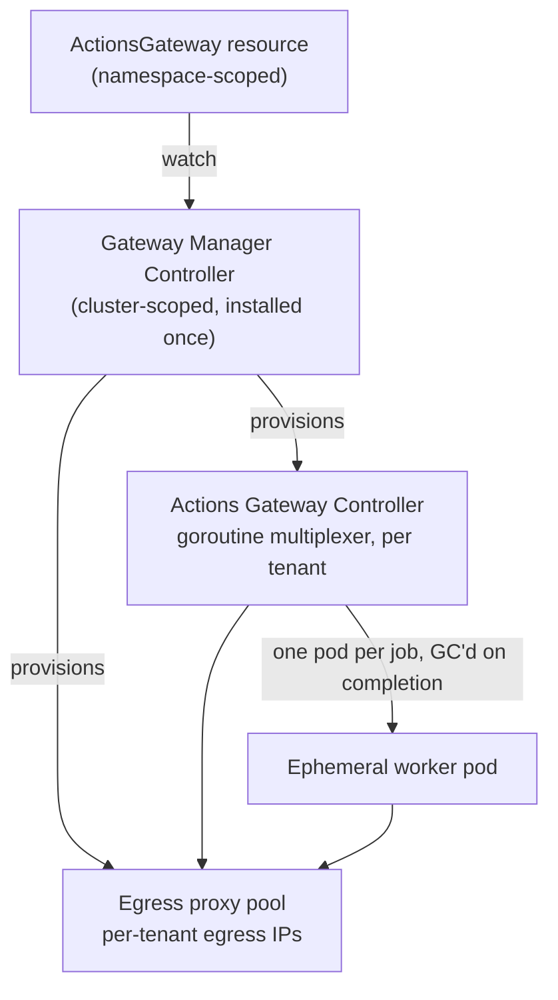

---
hide:
  - navigation
  - toc
---

<div class="gag-hero" markdown>

# Self-hosted GitHub Actions runners with zero idle compute

<p class="gag-tagline">An Actions Runner Controller (ARC) alternative for multi-tenant Kubernetes. Oversubscribe a shared quota for higher utilization, recover evicted jobs automatically, and give every tenant isolated GitHub egress IPs — all from one custom resource.</p>

[Get started](getting-started.md){ .md-button .md-button--primary }
[Why GAG?](why-gag.md){ .md-button }
[View on GitHub](https://github.com/actions-gateway/github-actions-gateway){ .md-button }

</div>

```sh
helm install gag charts/actions-gateway \
  --namespace gmc-system --create-namespace \
  --set gmc.image.digest=sha256:<gmc> \
  --set agc.image.digest=sha256:<agc> \
  --set proxy.image.digest=sha256:<proxy>
```

## What GAG gives you

<div class="gag-pillars" markdown>
<div class="grid cards" markdown>

-   :material-layers-triple:{ .lg .middle } __Priority-tiered scheduling__

    ---

    Reserve a floor of slots for expensive GPU runners that a flood of cheap CPU
    pods can't starve, then let higher tiers burst into spare capacity — so you
    can oversubscribe the quota instead of holding idle headroom in reserve.

-   :material-refresh-auto:{ .lg .middle } __Automatic eviction retry__

    ---

    When a worker pod is preempted, OOM-killed, or lost to a node failure, GAG
    fast-cancels the GitHub-side job lock and calls the rerun API, with a
    per-job retry budget — no manual rerun needed.

-   :material-ip-network:{ .lg .middle } __Per-tenant egress IP pool__

    ---

    Every tenant's GitHub traffic exits through a tenant-specific HTTPS CONNECT
    proxy pool, enabling per-team IP allowlisting on the GitHub side and
    containing rate-limit or abuse blast radius to one tenant.

-   :material-cube-outline:{ .lg .middle } __Self-service onboarding__

    ---

    A team creates a single `ActionsGateway` resource in their own namespace and
    receives a fully isolated gateway: RBAC, NetworkPolicies, `ResourceQuota`,
    egress proxy, controller, and every runner group they declared.

</div>
</div>

## Less always-on overhead

GAG scales workers to zero between jobs — the same property ARC scale-set mode
provides with `minRunners: 0` — but the listener is the difference. ARC runs one
~256 MiB .NET listener pod per scale set, held open 24/7 to long-poll GitHub.
GAG hosts every runner group's listener as a goroutine (~60 KiB) inside one
shared controller pod.

<div class="gag-stat" markdown>

<div class="gag-stat__card" markdown>
<div class="gag-stat__num">~2.5 GiB · 10 pods</div>
<div class="gag-stat__label">ARC scale-set listeners, 10 runner groups at rest</div>
</div>

<div class="gag-stat__card" markdown>
<div class="gag-stat__num">~600 KiB · 1 pod</div>
<div class="gag-stat__label">GAG goroutine multiplexer, same 10 runner groups</div>
</div>

</div>

## How it fits together

A four-tier system: one cluster-scoped manager provisions a fully isolated
gateway per tenant from each `ActionsGateway` resource.



Read the [architecture overview](design/02-architecture.md) for the full
breakdown, or jump to [why GAG over ARC](why-gag.md).
