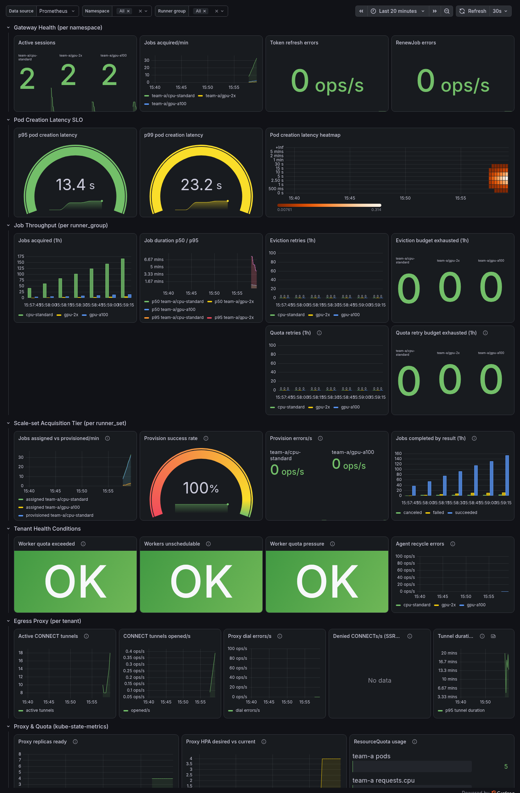
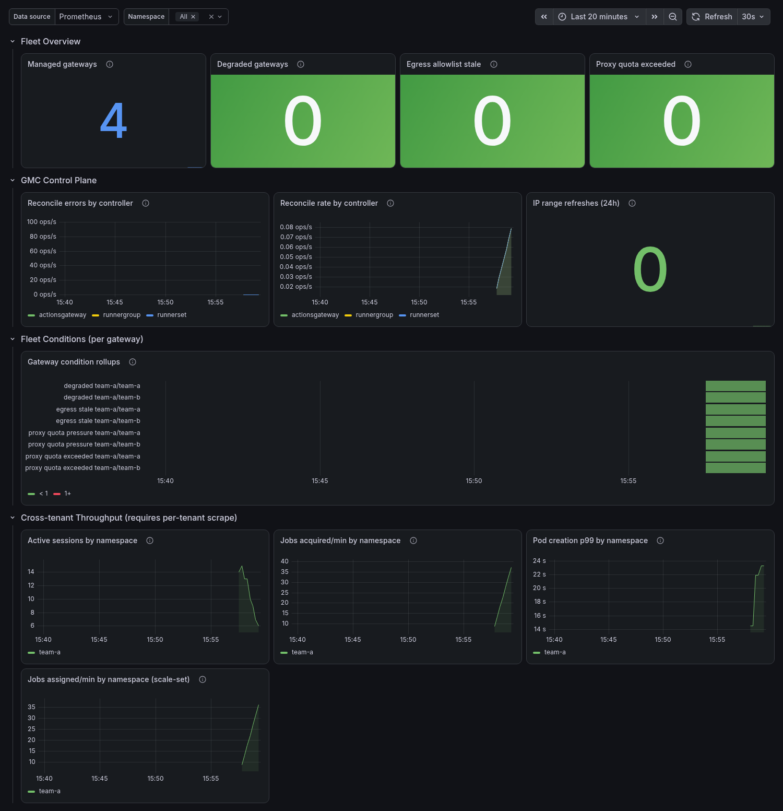

# Grafana Dashboards

> **Audience:** Platform engineer, Tenant operator

Part of the [Observability](observability.md) guide. The panels below query the [Metrics reference](observability-metrics.md) and the [SLO recording rules](observability-alerting.md#slo-recording-rules); the scrape wiring they depend on is in [Accessing metrics](observability-metrics-access.md).

> **Import as code.** Two reference dashboards ship under [`deploy/monitoring/`](../../deploy/monitoring/README.md) — import them into Grafana (**Dashboards → New → Import**) or provision them, rather than rebuilding the panels by hand. They split along the scrape boundary each reads from; the layouts below document what each contains.

| Dashboard | Source scrape | Audience |
| --- | --- | --- |
| [`grafana-dashboard-tenant.json`](../../deploy/monitoring/grafana-dashboard-tenant.json) | a tenant's AGC + egress proxy (per-tenant mTLS) | operator of one tenant's runners |
| [`grafana-dashboard-platform.json`](../../deploy/monitoring/grafana-dashboard-platform.json) | the GMC manager (one cluster-wide TLS scrape) | Platform engineer running the GMC / the fleet |

The split mirrors how the metrics are exposed (see [Accessing metrics](observability-metrics-access.md#how-to-access-metrics)): a platform operator scrapes the single GMC endpoint and cannot necessarily reach every tenant's mTLS metrics port, so the fleet rollups the GMC exports (`managed_gateways`, `runnergroups_degraded`, `egress_rules_stale`, the proxy-quota gauges) get their own dashboard.

> The screenshots below are rendered against a real Prometheus with synthetic data by the reproducible harness in [`deploy/monitoring/preview/`](../../deploy/monitoring/preview/README.md); regenerate them there whenever a dashboard changes.

## Tenant dashboard

Filtered by the `$namespace`, `$runner_group`, and `$runner_set` template variables. Uses the [SLO recording rules](observability-alerting.md#slo-recording-rules) as data sources where applicable.

**Row 1 — Gateway Health (per namespace)**

| Panel | Query | Visualization |
|-------|-------|---------------|
| Active sessions | `actions_gateway_active_sessions` | Stat / Time series |
| Jobs acquired/min | `rate(actions_gateway_jobs_acquired_total[5m]) * 60` | Time series |
| Token refresh errors | `rate(actions_gateway_token_refresh_errors_total[5m])` | Stat (threshold: >0 = red) |
| RenewJob errors | `rate(actions_gateway_renew_job_errors_total[5m])` | Stat (threshold: >0 = yellow) |

**Row 2 — Pod Creation Latency SLO**

| Panel | Query | Visualization |
|-------|-------|---------------|
| p95 latency | `actions_gateway:pod_creation_latency_seconds:p95` | Gauge (green <15s, yellow <60s, red >60s) |
| p99 latency | `actions_gateway:pod_creation_latency_seconds:p99` | Gauge |
| Latency heatmap | `rate(actions_gateway_pod_creation_latency_seconds_bucket[5m])` | Heatmap |

**Row 3 — Job Throughput (per runner_group)**

| Panel | Query | Visualization |
|-------|-------|---------------|
| Jobs acquired total | `increase(actions_gateway_jobs_acquired_total[1h])` | Bar chart by runner_group |
| Job duration p50/p95 | `actions_gateway:job_duration_seconds:p50/p95` | Time series |
| Disruption retries | `sum by (runner_group, tier, cause) (increase(actions_gateway_eviction_retries_total[1h]))` | Bar chart, split by acquisition tier (`classic`, `scaleset`) and cause (`eviction`, `preemption`, `deletion`, `abandoned`). Keep the causes visually distinct: `eviction` rising means node pressure, `preemption` rising means a `priorityTiers` floor is displacing opportunistic work, `abandoned` rising means workers are not being scheduled at all before `pendingPodDeadline` reaps them — different investigations entirely |
| Abandoned runs awaiting capacity | `sum by (runner_group, outcome) (increase(actions_gateway_abandoned_run_rerun_waits_total[1h]))` | Stat or bar chart. `expired` is the one to watch: a job whose run was force-cancelled and whose capacity never came back inside the wait window is a job silently lost until someone re-runs it by hand |
| Disruption budget exhausted | `increase(actions_gateway_eviction_retries_exhausted_total[1h])` | Stat (threshold: >0 = red) |
| Quota retries | `increase(actions_gateway_quota_retries_total[1h])` | Bar chart |
| Quota retry budget exhausted | `increase(actions_gateway_quota_retries_exhausted_total[1h])` | Stat (threshold: >0 = red) |

**Row 4 — Scale-set Acquisition Tier (per runner_set)**

The default acquisition protocol (Q264). These panels are the scale-set analog of the classic Gateway-Health and Job-Throughput rows above: a ScaleSet-protocol RunnerSet never emits `actions_gateway_active_sessions` or `jobs_acquired_total`, so its throughput and health are only visible here. Labelled by `runner_set` (not `runner_group`), so the `$runner_group` variable does not filter these — the `$runner_set` variable does.

| Panel | Query | Visualization |
|-------|-------|---------------|
| Jobs assigned vs. provisioned/min | `sum by (namespace, runner_set) (rate(actions_gateway_scaleset_jobs_assigned_total[5m])) * 60` and the `…_provisioned_total` counterpart | Time series (a persistent gap = provisioning lagging) |
| Provision success rate | `actions_gateway:scaleset_provision_success_rate:rate5m` | Gauge (green >0.99, yellow <0.99, red <0.9) |
| Provision errors/s | `sum by (namespace, runner_set) (rate(actions_gateway_scaleset_provision_errors_total[5m]))` | Stat (threshold: >0 = yellow) |
| Jobs completed by result (1h) | `sum by (result) (increase(actions_gateway_scaleset_jobs_completed_total[1h]))` | Bar chart by result |
| Worker pods reaped/s (by reason) | `sum by (namespace, runner_set, reason) (rate(actions_gateway_worker_pods_reaped_total{runner_set!=""}[5m]))` | Time series — the reaper counter's scale-set series (Q514), joinable with the capacity gauges above on `(namespace, runner_set)` |

**Row 5 — Tenant Health Conditions**

| Panel | Query | Visualization |
|-------|-------|---------------|
| Worker quota exceeded | `max(actions_gateway_worker_quota_exceeded or actions_gateway_runnerset_worker_quota_exceeded)` | Stat (1 = red) |
| Workers unschedulable | `max(actions_gateway_workers_unschedulable or actions_gateway_runnerset_workers_unschedulable)` | Stat (1 = red) |
| Worker quota pressure | `max(actions_gateway_worker_quota_pressure or actions_gateway_runnerset_worker_quota_pressure)` | Stat (1 = yellow) |
| Worker capacity declined | `max by (reason) (actions_gateway_runnerset_worker_capacity_declined)` | Stat (1 = orange), reason shown beside the value |
| Agent recycle errors | `rate(actions_gateway_agent_recycle_errors_total[5m])` | Time series |

> The first three capacity panels union the v1 `RunnerGroup` family with its
> `actions_gateway_runnerset_*` v2 twin (Q319). The two families key on different
> labels — `runner_group` and `runner_set` — so `or` unions rather than overlaps them,
> and a panel that named only the v1 family would read a flat `0` on a v2-only deploy.
> To break either out per owner, replace `max(...)` with
> `max by (namespace, runner_set) (actions_gateway_runnerset_...)`.

> **Worker capacity declined has no v1 twin, and `No data` is a normal reading**
> (Q643, Q658). The [gauge](observability-metrics.md) is emitted only for a
> `RunnerSet` that set `spec.capacityGate.mode`, so an empty panel means no set
> opted in, not that the query is broken. It groups by `reason` rather than
> reducing to a bare `0`/`1` because the value alone cannot separate a live decline
> from the latched `AwaitingProbe` state, and those call for different actions;
> exactly one series exists per gated set, so `max by (reason)` cannot double-count.
> The `1` is orange rather than red on purpose: a latched gate is
> [throttling intake, not failing](troubleshooting.md#runnerset-reports-workercapacitydeclined-the-gateway-stopped-claiming-jobs),
> and it can sit `True` indefinitely on an idle set whose shape stays unplaceable.

**Row 6 — Egress Proxy (per tenant)**

| Panel | Query | Visualization |
|-------|-------|---------------|
| Active CONNECT tunnels | `actions_gateway_proxy_connections_active` | Time series |
| CONNECT tunnels opened/s | `rate(actions_gateway_proxy_connections_total[5m])` | Time series |
| Proxy dial errors/s | `rate(actions_gateway_proxy_dial_errors_total[5m])` | Time series |
| Denied CONNECTs/s (SSRF signal) | `rate(actions_gateway_proxy_connect_denied_total[5m])` | Time series |
| Tunnel duration p95 | `histogram_quantile(0.95, rate(actions_gateway_proxy_tunnel_duration_seconds_bucket[5m]))` | Time series |

**Row 7 — Proxy & Quota (kube-state-metrics)**

| Panel | Query | Visualization |
|-------|-------|---------------|
| Proxy replicas ready | `kube_deployment_status_replicas_ready{deployment="actions-gateway-proxy"}` | Time series |
| HPA desired vs. current | `kube_horizontalpodautoscaler_status_*_replicas` | Time series |
| ResourceQuota usage | `kube_resourcequota{type="used"}` filtered by namespace | Bar gauge |

**Row 7 — Reliability Signals (Q315)**

| Panel | Query | Visualization |
|-------|-------|---------------|
| Job acquisition errors/s (by reason) | `sum by (namespace, reason) (rate(actions_gateway_job_acquisition_errors_total[5m]))` | Time series |
| Message poll errors/s (by reason) | `sum by (namespace, reason) (rate(actions_gateway_message_poll_errors_total[5m]))` | Time series |
| RenewJob teardowns/s (by reason) | `sum by (namespace, reason) (rate(actions_gateway_renew_job_teardowns_total[5m]))` | Time series |
| Worker pods reaped/s (by reason) | `sum by (runner_group, reason) (rate(actions_gateway_worker_pods_reaped_total[5m]))` | Time series |
| Broker token propagation retries/s | `sum by (runner_group) (rate(actions_gateway_broker_token_propagation_retries_total[5m]))` | Time series |

**Row 8 — Fan-out Safety (Q260 / Q266)**

| Panel | Query | Visualization |
|-------|-------|---------------|
| Duplicate job deliveries/s | `sum by (runner_group) (rate(actions_gateway_jobs_duplicate_delivery_total[5m]))` | Time series |
| Abandoned-delivery completions/s (by outcome) | `sum by (runner_group, outcome) (rate(actions_gateway_abandoned_delivery_completions_total[5m]))` | Time series |
| Fan-out loser recycle deferred/s (by outcome) | `sum by (runner_group, outcome) (rate(actions_gateway_fanout_loser_recycle_deferred_total[5m]))` | Time series |

## Platform dashboard

Fleet-wide; `$namespace` filters the cross-tenant rows.

**Row 1 — Fleet Overview**

| Panel | Query | Visualization |
|-------|-------|---------------|
| Managed gateways | `actions_gateway_managed_gateways` | Stat |
| Degraded gateways | `sum(actions_gateway_runnergroups_degraded)` (v1) / `sum(actions_gateway_runnersets_degraded)` (v2) | Stat (>0 = red) |
| Egress allowlist stale | `sum(actions_gateway_egress_rules_stale)` | Stat (>0 = red) |
| Proxy quota exceeded | `sum(actions_gateway_proxy_quota_exceeded)` | Stat (>0 = red) |

**Row 2 — GMC Control Plane**

| Panel | Query | Visualization |
|-------|-------|---------------|
| Reconcile errors by controller | `rate(controller_runtime_reconcile_errors_total[5m])` | Time series |
| Reconcile rate by controller | `rate(controller_runtime_reconcile_total[5m])` | Time series |
| IP range refreshes (24h) | `sum(increase(actions_gateway_ip_range_updates_total[24h]))` | Stat |

**Row 3 — Fleet Conditions (per gateway)**

| Panel | Query | Visualization |
|-------|-------|---------------|
| Gateway condition rollups | `actions_gateway_runnergroups_degraded` / `_egress_rules_stale` / `_proxy_quota_pressure` / `_proxy_quota_exceeded` (v1); `_runnersets_degraded` / `_agc_available` / `_egress_unattributed` (v2); `_github_egress_incomplete` (v2 `EgressProxy` only) | State timeline (1 = firing) |

**Row 4 — Cross-tenant Throughput** (requires the per-tenant AGC scrapes)

| Panel | Query | Visualization |
|-------|-------|---------------|
| Active sessions by namespace | `sum by (namespace) (actions_gateway_active_sessions)` | Time series |
| Jobs acquired/min by namespace (classic) | `sum by (namespace) (rate(actions_gateway_jobs_acquired_total[5m])) * 60` | Time series |
| Jobs assigned/min by namespace (scale-set) | `sum by (namespace) (rate(actions_gateway_scaleset_jobs_assigned_total[5m])) * 60` | Time series |
| Pod creation p99 by namespace | `actions_gateway:pod_creation_latency_seconds:p99` | Time series |

## Dashboard Variables

The dashboards ship with these template variables already wired:

- `$namespace` — `label_values({__name__=~"actions_gateway_active_sessions|actions_gateway_scaleset_jobs_assigned_total"}, namespace)` — filters to a single tenant (both dashboards). The union of the classic and scale-set series is deliberate: a scale-set-only deploy emits no `active_sessions`, so keying the variable on that alone would leave the dashboard blank.
- `$runner_group` — `label_values(actions_gateway_active_sessions{namespace="$namespace"}, runner_group)` — filters to a specific RunnerGroup on the classic-tier panels (tenant dashboard). The `runner_set`-labelled panels are not filtered by it; `$runner_set` is their variable.
- `$runner_set` — `label_values(actions_gateway_runnerset_worker_quota_pressure{namespace="$namespace"}, runner_set)` — filters to a specific `RunnerSet` on the scale-set and v2 capacity panels (tenant dashboard). It reads its label values from the Q319 capacity gauges rather than the `scaleset_*` series on purpose: those gauges are emitted for **every** `RunnerSet`, while `scaleset_*` exists only for `ScaleSet`-protocol sets, so keying on the latter would hide a `Classic` set from the dropdown entirely.

---

← Back to [Observability](observability.md)
